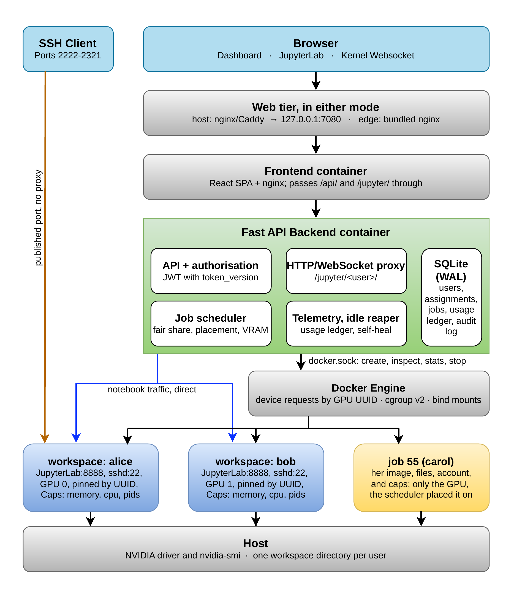

# GPU Platform — Multi-User GPU / CPU / RAM Management Platform

> **Version 1.0.** This file is the reference: how the platform is built, what
> every setting does, and why each decision went the way it did. If you only
> want to get something done, start with the guides instead, the
> **[administrator guide](docs/admin-guide.md)** and the
> **[user guide](docs/user-guide.md)**.
>
> The [development history](#development-history) at the end records what was
> rebuilt along the way and why, which is usually the part you want when
> something surprises you.

---

## Overview

GPU Platform is a self-hosted web application for sharing one machine's NVIDIA
GPUs, CPU, RAM and disk between several people. An administrator hands out the
resources; each user gets a JupyterLab session of their own, with SSH into the
same place, and can only see what they were given.

It was written for the situation most research groups are actually in: one
workstation with a couple of cards in it, a handful of people who need them,
and nobody whose job is to run a cluster.

| Feature | Description |
|---|---|
| Multi-user login | Per-user accounts, JWT sessions, instant revocation |
| Self-service account | Users edit their own name and email, and change one password that covers the dashboard, SSH and Jupyter |
| GPU assignment | Admin pins GPU 0, GPU 1 or both to each user, enforced by the Docker device cgroup |
| Isolated JupyterLab | One container per user; kernels, terminals and SSH all work through one authenticated entry point |
| Resource monitoring | GPU, CPU, RAM, disk and per-user container usage, live |
| Quotas | Per-user disk budget, plus weekly GPU-hour and CPU-hour budgets on batch jobs, applied at submission and again while a job runs |
| Usage accounting | Durable ledger of every session: GPU-hours, peak RAM, why it ended |
| Audit trail | Every privileged action recorded with actor, target and IP |
| Idle reclamation | Optional automatic stop of sessions nobody is using |
| Flexible fronting | Runs behind your existing nginx/Caddy, or brings its own |

---

## Architecture



The Docker Engine is on the *lifecycle* path, not the *traffic* path: it
creates a container and is asked about it afterwards, while a notebook is
proxied straight to the container over the Docker network. The same picture is
Figure 1 of the article cited at the end of this file.

* The **frontend container** serves the SPA and proxies `/api` and `/jupyter` to
  the backend over the Docker network. In `HTTP_MODE=host` it *is* the public
  entry point, so nothing in the stack competes for ports 80/443.
* The **backend** owns authentication, assignments, quotas, accounting, the
  per-user container lifecycle, and proxies all Jupyter traffic (HTTP **and**
  WebSocket) so the browser never needs to know an internal port.
* **User containers** (`gpu-jupyter-<user>`, and `gpu-job-<id>` for a batch
  job) are pinned to specific GPUs by UUID through Docker device requests,
  capped with cgroups, and reachable only by DNS name inside the platform
  network. The exception is each workspace's `sshd`, which gets a published
  port from `SSH_PORT_START`–`SSH_PORT_END` because an SSH session cannot be
  carried over the HTTP proxy.

---

## Prerequisites

* **Docker** and **Docker Compose v2** (`docker compose`)
* **NVIDIA GPU(s)** with working drivers (`nvidia-smi`)
* **nvidia-container-toolkit** so containers can be given GPUs

> **Scope of v1.0: GPUs without MIG.** A whole physical GPU is the unit this
> version hands out, identified by UUID. It does not drive MIG instances, and
> on a card with MIG enabled it has not been tested at all — the authors have
> no MIG-capable device to verify against, and shipping the feature untested
> would contradict the one thing the rest of this platform argues for, which is
> reading back what was actually applied instead of trusting what was
> configured. This is the intended hardware anyway: MIG is not available on
> GeForce-class cards, which is what the groups this targets own. The
> consequence is that a VRAM reservation here is bookkeeping and not a hardware
> barrier; see [Batch jobs](#batch-jobs-sharing-gpus-by-time) for what that
> does and does not buy you.

### Install nvidia-container-toolkit (Ubuntu/Debian)

```bash
curl -fsSL https://nvidia.github.io/libnvidia-container/gpgkey \
  | sudo gpg --dearmor -o /usr/share/keyrings/nvidia-container-toolkit-keyring.gpg

curl -s -L https://nvidia.github.io/libnvidia-container/stable/deb/nvidia-container-toolkit.list \
  | sed 's#deb https://#deb [signed-by=/usr/share/keyrings/nvidia-container-toolkit-keyring.gpg] https://#g' \
  | sudo tee /etc/apt/sources.list.d/nvidia-container-toolkit.list

sudo apt-get update && sudo apt-get install -y nvidia-container-toolkit
sudo nvidia-ctk runtime configure --runtime=docker
sudo systemctl restart docker
```

Verify: `docker run --rm --gpus all nvidia/cuda:12.0-base-ubuntu22.04 nvidia-smi`

---

## Quick start

```bash
cd workspace-gpu
./deploy.sh          # detects GPUs, picks the HTTP mode, builds and starts everything
```

You can run `deploy.sh` as often as you like. It builds the per-user Jupyter
image *before* starting the stack rather than at session start, which would
otherwise block the API for several minutes the first time somebody logs in. It
also reconciles `.env` with whatever the host currently looks like, and prints
the next step for the HTTP mode it picked.

Two things it does on the way, both of them lessons from getting this wrong:

**It snapshots before it starts.** `.env`, the database and the fully merged
compose configuration go to `data/backups/` first, last twenty kept. The
database copy is taken with `sqlite3 .backup` and not with `cp`: the database
runs in WAL mode, so a plain copy silently leaves behind whatever is still in
the write-ahead log — on this host that was three jobs out of 227, in a file
whose `PRAGMA integrity_check` still says `ok`. The compose snapshot is the one
that answers "was the GPU overlay actually applied", which is not a question you
want to be reverse-engineering from a broken stack.

**It refuses rather than downgrading.** If `.env` says
`SESSION_BACKEND=container` and no usable GPU is detected, `deploy.sh` stops
with an error instead of rewriting `.env` to `process`. A transient
`nvidia-smi` failure is far likelier than a host losing its cards, and the
downgrade was one-way: nothing put it back, so one bad reading turned a GPU
platform into a CPU one until somebody read the code to find out why every
workspace had stopped working. If the host really has no GPU any more, say so:

```bash
FORCE_CPU_ONLY=1 ./deploy.sh
```

Once it is up, the [administrator guide](docs/admin-guide.md) walks through
first sign-in, accounts, quotas and the day-to-day jobs; hand your users the
[user guide](docs/user-guide.md).

---

## Deployment modes: with or without the bundled nginx

The HTTP entry point is configurable, because most GPU boxes are already
serving something on ports 80 and 443.

| | `HTTP_MODE=host` | `HTTP_MODE=edge` |
|---|---|---|
| Who owns :80/:443 | **Your existing** nginx / Caddy / Apache | The bundled `nginx` container |
| What the stack publishes | `WEB_BIND:WEB_PORT` only (default `127.0.0.1:7080`) | `:80` and `:443` |
| TLS | Your existing certbot / certificates | `nginx/ssl/` + `nginx/nginx.conf` |
| Compose files | `-f docker-compose.yml -f docker-compose.host.yml` | `-f docker-compose.yml --profile edge` |
| Use when | The machine already hosts other sites | Dedicated box, nothing else on those ports |

`deploy.sh` picks the mode automatically (host mode when port 80 is already in
use) and honours an explicit `HTTP_MODE` in `.env`.

**Two nginx layers, and why that is fine.** In host mode a request crosses two
of them: yours, then the one inside the frontend container that serves the
built SPA and proxies `/api/` and `/jupyter/`. The inner one is not
redundant, it is what makes the stack a single port you can point anything at,
and the cost is one loopback hop. What it does mean is that four things have
to agree at both layers, and the shipped
[`nginx/host/gpu-platform.conf`](nginx/host/gpu-platform.conf) already sets
them:

* **the WebSocket upgrade**, or JupyterLab loads and no cell ever runs;
* **`client_max_body_size`**, since the smaller of the two wins and the
  default 1 MB refuses any real dataset;
* **long `proxy_read_timeout` with `proxy_buffering off` on `/jupyter/`**, or
  a kernel is cut off mid-computation;
* **`X-Forwarded-For` set to `$remote_addr` at the OUTERMOST layer**. Use
  `$proxy_add_x_forwarded_for` there and whatever the client sent is kept and
  the platform's address appended, so the caller decides which IP lands in the
  audit log and which one the login throttle counts. Replacing it discards
  that claim; the inner layer then appends, and the first entry is the real
  caller again.

### Using the host's nginx (recommended on a shared machine)

```bash
# 1. .env
HTTP_MODE=host
WEB_BIND=127.0.0.1
WEB_PORT=7080

# 2. Start — no container touches :80/:443
docker compose -f docker-compose.yml -f docker-compose.gpu.yml \
               -f docker-compose.host.yml up -d

# 3. Host firewall: needed when the host defaults to DROP (see below)
sudo bash scripts/host_firewall_setup.sh --check
sudo bash scripts/host_firewall_setup.sh

# 4. Point your nginx at it
sudo cp nginx/host/gpu-platform.conf /etc/nginx/sites-available/gpu-platform
sudo nano /etc/nginx/sites-available/gpu-platform     # set server_name
sudo ln -sf /etc/nginx/sites-available/gpu-platform /etc/nginx/sites-enabled/
sudo nginx -t && sudo systemctl reload nginx

# 5. TLS
sudo certbot --nginx -d gpu.example.com
```

> **If the host firewall defaults to DROP, do step 3 or the site returns 504.**
> Containers sit on the Docker bridge `gpu-platform0` (the name is pinned in
> `docker-compose.yml` so firewall rules keep matching when the network is
> recreated). With `-P OUTPUT DROP` and no rule for that bridge, `docker-proxy`
> accepts the connection on loopback but cannot forward it to the container, so
> the reverse proxy times out. `deploy.sh` checks for this and names the fix.

`nginx/host/gpu-platform.conf` already contains everything Jupyter needs:
day-long timeouts and `proxy_buffering off` on `/jupyter/`, WebSocket upgrade on
both `/jupyter/` and `/api/` (the live-resource socket lives on `/api/gpu/ws`),
and a 2 GB upload limit.

> If another site on the host already defines `$connection_upgrade`, delete the
> `map` block at the top of the file — nginx allows only one definition per name.

### Using the bundled nginx

```bash
# .env: HTTP_MODE=edge
docker compose -f docker-compose.yml -f docker-compose.gpu.yml --profile edge up -d
```

Without `--profile edge` the `nginx` service is never created at all. That is
what keeps host mode safe: there is no container that could grab port 80 behind
your back.

---

## Configuration

All configuration lives in `.env` (start from `.env.example`).

### Core

| Variable | Default | Description |
|---|---|---|
| `SECRET_KEY` | *(generated)* | JWT signing **and** the key session secrets are encrypted with. Rotating it logs everyone out and invalidates stored session secrets. |
| `ADMIN_PASSWORD` | `admin123` | Initial password for `admin` — change it |
| `HTTP_MODE` | auto | `host` or `edge` (see above) |
| `WEB_BIND` / `WEB_PORT` | `127.0.0.1` / `7080` | Where the stack publishes itself in host mode |
| `BACKEND_BIND` | `127.0.0.1` | Bind address for the API port (debugging) |
| `GPU_COUNT` | `2` | Number of GPUs on the host |
| `ALLOW_MOCK_GPU` | `false` | Return simulated GPUs when `nvidia-smi` is unavailable. **Keep off in production** — phantom hardware let admins assign GPUs that do not exist |

### Sessions

| Variable | Default | Description |
|---|---|---|
| `SESSION_BACKEND` | `container` | `container` (one Docker container per user) or `process` (legacy subprocess) |
| `JUPYTER_IMAGE` | `gpu-jupyter:latest` | Default per-user image |
| `JUPYTER_IMAGES` | *(empty)* | Allow-list users may choose from: `PyTorch=my/pytorch:2.3,TF=my/tf:2.16`. Anything outside it is rejected |
| `JUPYTER_DATA_DIR` | `/jupyter_data` | Per-user data root inside the backend |
| `JUPYTER_DATA_HOST_DIR` | *(set by deploy.sh)* | The same directory **as the Docker host sees it** — bind mounts are resolved host-side, so a stale value from another machine breaks every session |
| `KEEP_SESSIONS_ON_SHUTDOWN` | `true` | User notebooks survive a backend restart/update |

### Resource limits

| Variable | Default | Description |
|---|---|---|
| `DEFAULT_MEMORY_LIMIT_MB` | `8192` | RAM cap per user (cgroup in container mode, rlimit in process mode) |
| `DEFAULT_CPU_CORES` | `2` | CPU-core cap per user container |
| `DEFAULT_CPU_LIMIT_SECONDS` | `0` | `RLIMIT_CPU`: CPU-seconds one process tree may burn before the kernel kills it. **Process backend only** — cgroups cannot express it, and the admin form no longer offers it. Set cores with the assignment's *CPU cores* field and a compute budget with `DEFAULT_CPU_HOURS_QUOTA` |
| `CONTAINER_PIDS_LIMIT` | `512` | cgroup `pids.max` — the fork-bomb ceiling |
| `DISK_READ_BPS_MB` / `DISK_WRITE_BPS_MB` | `150` / `80` | Hard per-container I/O ceilings (MB/s) |
| `DISK_READ_IOPS` / `DISK_WRITE_IOPS` | `0` | Optional operation-count caps (useful on HDDs) |
| `BLKIO_WEIGHT` | `500` | Fair share when containers contend for the disk |

### Quotas and lifecycle

| Variable | Default | Description |
|---|---|---|
| `DEFAULT_DISK_QUOTA_MB` | `0` | Per-user workspace budget; `0` = unlimited. Over budget, the GPU and the queue are refused, never the workspace itself |
| `QUOTA_PERIOD` | `week` | How long a time budget lasts before it refills: `week` (Monday) or `month` (the 1st) |
| `QUOTA_TZ_OFFSET_HOURS` | `0` | Hours east of UTC, so "refills on Monday" means the user's Monday. Hanoi = `7` |
| `DEFAULT_GPU_HOURS_QUOTA` | `0` | GPU-hours a user's **jobs** may spend per period, counted as hours × cards held; `0` = unlimited. Interactive sessions are not counted |
| `DEFAULT_CPU_HOURS_QUOTA` | `0` | CPU core-hours their **jobs** may spend per period, as hours × cores allocated; `0` = unlimited |
| `JOB_TIME_QUOTA_ACTION` | `requeue` | A **running GPU job** whose owner has run out: `requeue` puts it back in the queue to start again when the budget refills, `stop` fails it, `warn` lets it run |
| `JOB_TIME_QUOTA_CPU_ACTION` | `pause` | The same for a job holding **no GPU**: `pause` freezes it where it stands and the scheduler resumes it at the refill. Anything else falls back to the setting above |
| `QUOTA_REFRESH_INTERVAL_SECONDS` | `60` | How often a running workspace's copy of these figures is refreshed for its `limits` command. The budgets themselves are applied by the scheduler |
| `DISK_QUOTA_ACTION` | `warn` | What to do about a **running** session over its disk quota: `warn` (audit + flag) or `stop` |
| `IDLE_TIMEOUT_MINUTES` | `0` | Stop sessions with no traffic for this long; `0` = never |
| `REAPER_INTERVAL_SECONDS` | `300` | How often the idle reaper scans |
| `METRICS_INTERVAL_SECONDS` | `10` | Telemetry refresh (`docker stats` is blocking, so it runs in a worker thread) |
| `GPU_KEEPER_INTERVAL` | `120` | In-container GPU keep-alive interval |
| `SELF_HEAL_INTERVAL` | `30` | Dead-container rescan interval |
| `GPU_GUARD_INTERVAL` | `1` | How often VRAM is sampled and the reservation enforced. One `nvidia-smi` covers every job, so this does not get dearer as the queue grows. If that scan cannot run, the guard stands down and the scheduler's own `JOB_SCHEDULER_INTERVAL` cycle does the work instead |

Per-user overrides for all three quotas live in **Admin → Users** and win over
these defaults.

Sizing the two job budgets: capacity per week is `GPUs × 168` GPU-hours and
`(cores − JOB_CPU_RESERVED_CORES) × 168` CPU-hours. Divide by the number of
people who need the queue at once for an equal share, then round up, since a
budget is a ceiling against one person taking everything, not a ration everyone
is expected to spend. On the two-GPU, 32-core reference host with four active
users that is 336 / 4 ≈ **84 GPU-hours** and 4704 / 4 ≈ **1200 CPU-hours** a
week each.

### Security

| Variable | Default | Description |
|---|---|---|
| `ACCESS_TOKEN_EXPIRE_MINUTES` | `480` | JWT lifetime. Revocation does **not** depend on it |
| `MIN_PASSWORD_LENGTH` | `10` | Minimum password length (a letter and a digit are also required) |
| `COOKIE_SECURE` | `false` | Force the `Secure` flag on the Jupyter proxy cookie. Set `true` when TLS terminates upstream |
| `LOGIN_MAX_FAILURES` | `8` | Failures before lockout, counted per username **and** per IP |
| `LOGIN_FAIL_WINDOW_SECONDS` | `300` | Sliding window for the failure count |
| `LOGIN_LOCKOUT_SECONDS` | `900` | Lockout duration |
| `UNIFIED_PASSWORD` | `true` | One password per user: Jupyter and the container's UNIX account both accept the **platform account password** (see below) |
| `SSH_PASSWORD_AUTH` | `true` | Accept password auth over SSH at all. `false` = key-only |
| `SSH_ENABLED` | `true` | Per-user sshd inside user containers |
| `SSH_PORT_START` / `SSH_PORT_END` | `2222` / `2321` | Host port pool for user SSH |

---

## Usage

This section is the tour. Both roles have a task-by-task guide of their own:
the [administrator guide](docs/admin-guide.md) and the
[user guide](docs/user-guide.md).

### Admin

1. Sign in as `admin` and change the password immediately.
2. **Admin → Resources** — host CPU/RAM/disk, every GPU with the users on it,
   and a per-user table of CPU, RAM, disk and GPU-hours.
3. **Admin → Users** — create accounts and set each person's disk quota and
   their weekly GPU-hour and CPU-hour budgets for jobs.
4. **Admin → Assignments** — grant GPUs and per-user RAM / CPU caps. Every field is
   optional and at least one must be set, so a user can be capped on CPU and RAM
   without being given any GPU.
5. **Admin → Jupyter Sessions** — see and force-stop live sessions.
6. **Admin → Usage** — GPU-hours per user over 7/30/90 days plus every session.
7. **Admin → Audit** — logins, failures, user changes, assignment changes,
   session starts/stops/reaps, with actor and IP.

### User

1. **Launch JupyterLab** — the platform starts a personal container and opens
   `/jupyter/<username>/`. No token in the URL and no login prompt: the
   platform session is the authentication. Inside,
   `torch.cuda.device_count()` returns exactly the number of GPUs granted.
2. **Resource usage** card — live CPU, RAM, process count and disk I/O of your
   own session, plus your disk usage and how much of your job budget is left.
3. **Environment** — pick a Jupyter image when the platform offers more than one.
4. **SSH access** — the dashboard shows the port; sign in with **your account
   password**, or register a public key (which applies immediately, no restart).
5. **Jupyter password** — optional. Only needed to add a second factor in front
   of JupyterLab; by default your account password already works there.
6. **Your name, in the navbar, is a menu** — **Edit your details** and **Change
   password** open over the page you are on. Nothing behind them is lost, and
   changing your password neither signs you out nor interrupts the workspace
   you have running.
7. **Jobs** come in two tables. What is in flight is never paged, and shows
   what each job is placed on, how long it has run and, for a job that is
   waiting, why. The history below it is paged ten at a time, and since it
   gets long it can be narrowed to one status, searched by name or script, and
   sorted by clicking a column: id, status, name, runtime, when it was
   submitted or when it finished. Filtering and sorting happen on the server,
   so they cover the whole history rather than the page in front of you.
8. A job of yours may show as **Paused**. That is the platform holding it
   while you are out of CPU hours; it thaws by itself when the budget refills
   and carries on from the same point.

---

## Resource management

### One password per user

A user has one password, the one they log into the platform with, and it also
works for JupyterLab and for SSH into their container. There is nothing to
configure, no separate SSH password to copy off the dashboard, and no token in
any URL.

We started out with three passwords and it was miserable. The reason there were
three is that the account password is stored as bcrypt, and bcrypt cannot be
turned into the formats Jupyter and sshd want. Rather than keep two more
secrets around, the platform derives what each of them needs at the moments the
plaintext is legitimately in hand: account creation, password change, admin
reset, and a successful login, which is what backfills accounts created before
any of this existed.

| Derived value | Format | Used by |
|---|---|---|
| `account_jupyter_hash` | `argon2:$argon2id$…` | Jupyter's `IdentityProvider.hashed_password` |
| `unix_password_hash` | `$6$…` (sha512-crypt) | the container's `/etc/shadow`, via `chpasswd -e` |

Neither digest is reversible, and the plaintext is never stored, logged or
handed to a container. Changing the password updates both and pushes the new
UNIX digest into the running container, so SSH picks it up straight away
without a session restart.

In practice Jupyter never asks for a password. The proxy has already
authenticated the request and presents Jupyter's own session token upstream, so
the user lands directly in JupyterLab. The derived password is there for the
uncommon case of reaching Jupyter's login form some other way, and the account
password is what works there.

Setting a password under *Jupyter password* on the dashboard is optional, and
it changes the meaning of that form. It becomes a real second factor: the proxy
stops vouching for you, and the form has to be satisfied even when you arrive
from the dashboard.

> **Worth knowing.** With `UNIFIED_PASSWORD=true` the account password also
> opens an SSH session on a port range that is reachable from the internet, and
> sshd does not go through the platform's login throttling and lockout. If that
> bothers you, have people register SSH keys and set `SSH_PASSWORD_AUTH=false`.
> Key-based login keeps working and the exposure goes away.

### GPU assignment

Each user's container is created with a Docker device request naming the UUIDs
of the GPUs they were granted. That request becomes a device cgroup in the
kernel, so the container cannot see, open or use any other card no matter what
the user does to `CUDA_VISIBLE_DEVICES`. Inside the container the granted GPUs
are renumbered from 0.

We use UUIDs and not indices because the driver is free to reorder indices
(`CUDA_DEVICE_ORDER`, hot-plug, MIG), whereas a UUID always means the same
physical card.

### An assignment is not a share

This is the most useful thing we learned from running the platform, and it is
easy to get backwards.

Assigning GPU 0 to someone gives them **unrestricted** use of it. No fair-share
score applies to an interactive workspace, nothing caps how much VRAM they take
or how long they hold it, and the platform has no opinion about whether they
are using it. That is correct for a person with sustained work who genuinely
needs a card all day. It is the wrong default for a group.

Jobs can still be placed on an assigned card, because placement only looks at
free VRAM (`JOB_GPU_POOL` is every GPU unless you narrow it). But the person
holding the card can allocate the rest of it at any moment, and the job that
landed beside them is the one that dies. From the queue's point of view an
assigned card is capacity it cannot rely on.

**So if you want the cards shared, assign them to nobody.** Give people limits
without a GPU — the assignment form allows exactly that, every field is
optional — and let them reach the hardware through `submit`. Then fair share
decides who runs next, every run is booked to the ledger, and an idle card goes
to whoever has used the least. Keep assignments for the exceptions and make
them justify themselves.

A reasonable arrangement for a group of ten:

| Who | What they get |
|---|---|
| One or two people with long, continuous training runs | A GPU assignment |
| Everybody else | Memory, core and process limits, no GPU, and the job queue |
| Nobody | An assignment "just in case", which is an idle card with a name on it |

### RAM, CPU, PIDs

cgroups (`--memory`, `--cpus`, `pids.max`) applied to the whole container, with
swap disabled so the memory cap cannot be evaded. Limits come from the user's
assignment and fall back to the platform defaults.

### Disk I/O

One person copying a dataset should not be able to starve everyone else.
There are two ways to arrange that, and in practice only the first is available:

| Control | Effect |
|---|---|
| `DISK_READ_BPS_MB` / `DISK_WRITE_BPS_MB` | **Hard ceiling** per container, in force whether or not the disk is busy |
| `BLKIO_WEIGHT` | **Fair share** under contention, so somebody working alone is not slowed down. Inert on cgroup v2; see below |

The backing block device is detected automatically. Settings the daemon
refuses are dropped with a warning instead of failing the session.

**`BLKIO_WEIGHT` does nothing on cgroup v2, and the platform does not send it
there.** This is worth spelling out because the variable is still in
`.env.example` and it looks like it works. `--blkio-weight` is a cgroup v1
control. On the v2 unified hierarchy Docker and runc will happily accept it and
convert it to `io.weight` (500 becomes 4950), but `io.weight` is only *honoured*
when the device runs the **BFQ** scheduler or has **blk-iocost** configured.
Neither is the default. On the reference host, an NVMe on `none`/`mq-deadline`
with no iocost, the value would be written and then ignored, so the platform
skips it and `docker inspect` reports `BlkioWeight: 0`.

None of this is about the hardware. It is the I/O scheduler and the cgroup
version. To get proportional sharing back you would enable one of:

```bash
# BFQ: designed for rotational and single-queue devices.  Works, but it costs
# CPU and throughput on fast NVMe, which is why it is not the default there.
sudo modprobe bfq
echo bfq | sudo tee /sys/block/nvme0n1/queue/scheduler

# blk-iocost: the cgroup v2 answer for fast devices.  Needs a cost model for
# the disk; see Documentation/admin-guide/cgroup-v2.rst.
```

Until then the hard ceilings are the whole story, so it is worth sizing them
against the disk you actually have rather than leaving the shipped defaults.
Measure it first, with direct I/O so the page cache stays out of the way:

```bash
dd if=/dev/zero of=probe bs=1M count=800 oflag=direct   # write
dd if=probe of=/dev/null bs=1M iflag=direct             # read
rm probe
```

Then divide by the number of people you expect to be copying data at the same
time. On the reference host that measures 3.2 GB/s read and 3.7 GB/s write, so
four simultaneous copiers works out at roughly 800 MB/s read and 900 MB/s
write.

The defaults of 150/80 MiB/s are deliberately timid because the shipped
configuration has no idea what disk it will land on. On this NVMe they leave a
lone user at 4.9% of the read and 2.3% of the write the hardware can do, and it
would take twenty containers reading flat out to saturate it. If your disk is
fast, raise them.

### What is actually enforced

A limit a configuration file mentions is not a limit. The numbers below come
from a live workspace on the reference host, assigned one GPU, 10,048 MiB of
RAM, 10 cores, 512 processes and 150/80 MiB/s of disk.

| Limit | Mechanism | Probed from inside |
|---|---|---|
| RAM | cgroup `memory.max` | holds 10,536,091,648 bytes with swap equal to it; 4 of the 55 jobs run here so far ended `OOMKilled`, each inside its own container |
| CPU | cgroup `cpu.max` | 24 busy processes against a 10-core cap burned 60.30 CPU-seconds in 6.00 s of wall clock, i.e. **10.04 cores** |
| Processes | cgroup `pids.max` | 512, refuses further forks |
| Disk read | cgroup `io.max` | cap 150 MiB/s, `dd` with `iflag=direct` measured **158 MB/s** |
| Disk write | cgroup `io.max` | cap 80 MiB/s, `dd` with `oflag=direct` measured **83.9 MB/s** |
| GPU | Docker device request | `nvidia-smi -L` lists 1 of the host's 2, UUID matching the request, while `NVIDIA_VISIBLE_DEVICES` is empty |
| **Disk space** | **none** | **not enforced by the kernel, see below** |

The disk figures look like an overshoot and are not one. The caps are set in
MiB/s and `dd` reports MB/s: 150 MiB/s is 157.29 MB/s and 80 MiB/s is 83.89,
so both landed on the cap to three significant figures.

Don't trust the settings, read back what was actually applied per user:
`GET /api/user/me/resources` → `enforced`, and **Admin → Resources** shows the
same thing. This matters more than it sounds. The reference host is configured
with `BLKIO_WEIGHT=500` and every container has no weight at all, for the
reason in the next section. Echoing the configuration would have reported a
kind of fair sharing that nothing on the machine was doing.

### Why the standard tools report the wrong numbers

`df`, `free`, `nproc` and `top` are not cgroup-aware. They read machine-wide
values out of `/proc` and `/sys`, so a properly limited workspace will happily
tell you it has every CPU on the machine, all of its RAM and the whole shared
disk. (Those `tmpfs` lines `df` used to print were runc masking sensitive
`/sys` paths, not storage.)

The workspace therefore ships cgroup-aware replacements on `PATH` ahead of
`/usr/bin`. They report the allocation rather than the machine, and the real
ones are still there as `/usr/bin/<name>`:

| Command | What it reports |
|---|---|
| `limits` | The full allocation (also printed on every interactive SSH login) |
| `nproc` | Allocated cores, so `make -j$(nproc)` sizes itself correctly |
| `free` | Allocated memory, in the real `free` layout |
| `df` | The workspace with its allocated size; internal pseudo-mounts are dropped |
| `top` | The allocation, then the real `top` |

```
Your workspace
----------------------------------------------------------
  Memory        70.8 MiB used of 2.9 GiB
  CPU           2 cores
  Processes     8 of 512
  Disk speed    read 150.0 MiB/s, write 80.0 MiB/s
  Disk space    0 B used of 4.9 GiB (0%)
  GPU           NVIDIA GeForce RTX 4090, 49140 MiB
----------------------------------------------------------
```

Everything a user sees is written from where they sit. As far as they are
concerned the workspace is their machine, and nothing in front of them talks
about hosts, containers or cgroups. That kind of detail belongs in the admin
views and the server log, where somebody can actually do something with it.

### The shell

Terminals, both JupyterLab's and SSH, run bash with a colour prompt, tab
completion and history. `SHELL` has to be set in the image: JupyterLab launches
`$SHELL` and otherwise falls back to `/bin/sh`, which on Ubuntu is dash. You
get a bare `$` prompt, no colours and no completion, and it looks broken.

The image carries the things a shell needs to feel like one:
`bash-completion`, `procps` (`ps`, `top`, `free`), `git`, `less`, `nano`,
`vim`, `wget`, `unzip`, `bzip2`, `xz-utils` and `rsync`. The prompt reads
`you@workspace`.

Anything else goes in with `pip install`, which persists in `.local`, or by
installing into the workspace. Miniconda works fine:

```bash
curl -fsSLO https://repo.anaconda.com/miniconda/Miniconda3-latest-Linux-x86_64.sh
bash Miniconda3-latest-Linux-x86_64.sh -b -p ~/miniconda3
```

> The cgroup-aware `df` and `free` only rewrite the plain interactive forms
> (`df`, `df -h`, `free -m`). Any other option, such as `df -Pk` or `free -w`
> or anything else a script would use, goes to the real tool untouched.
> Installers do arithmetic on that output, and one of them died doing it.

### Disk space is a soft quota

There is no filesystem quota here. `jupyter_data/<user>` is a plain bind
mount, so nothing in the kernel stops a user filling the host disk, and `df`
inside the container shows that whole disk because it really is the disk they
are writing to.

What the platform does instead:

* refuses to **start** a session for a user already over quota;
* re-checks every running session on the reaper interval and follows
  `DISK_QUOTA_ACTION`: `warn` records it in the audit log and flags the user
  under **Admin → Resources**, while `stop` also stops the session and frees
  the GPU;
* shows the real figure in `platform-limits` and on the dashboard.

If you want hard enforcement you need a filesystem that can do it: XFS or
ext4 project quotas on the partition holding `JUPYTER_DATA_DIR`, or a volume
per user. That is a storage decision on the host, and not something the
platform can impose from inside a container.

### Quotas

* **Disk**: `du` of `jupyter_data/<user>` against their budget, cached.
* **Job GPU hours**: wall clock × GPUs held, for batch jobs.
* **Job CPU hours**: wall clock × cores allocated, for batch jobs.

The two time budgets cover **the queue, and nothing else**. A workspace is
somebody's own seat at the machine: they opened it, they are sitting in front
of it, and their assignment already bounds what it may hold at any moment. The
queue is the opposite, work handed over in bulk to run unattended, where one
person with a loop that submits fifty jobs takes the machine from everybody
else without meaning to. So an interactive session costs nothing here. (A
session left open and unused is a real problem, but it is
`IDLE_TIMEOUT_MINUTES`' problem, not the budget's.)

They run per period, a week by default (`QUOTA_PERIOD`, refilling at local
midnight on Monday; set `QUOTA_TZ_OFFSET_HOURS` so "Monday" means the user's
Monday). A job is charged for what it *holds*, not for what it manages to use:
an hour on two GPUs is two GPU-hours and an hour of a four-core job is four
CPU-hours, busy or idle, because holding the hardware is what denies it to
somebody else. A job still running counts as it goes, so a three-day run cannot
outrun the budget it started inside, and a job that straddles a Monday is split
between the two weeks.

Two gates, both reading the same figures:

* **Submitting**: refused with 429, naming the budget and the day it refills.
  Being over the disk budget refuses a job too, since a job only adds output;
  it never refuses a workspace, which is the only place a user can delete files
  from.
* **Already running**: the scheduler checks on each pass, and what happens
  next depends on whether the job holds a card.
  * **A CPU-only job is frozen** (`JOB_TIME_QUOTA_CPU_ACTION=pause`, the
    default). Every process in it stops where it stands, and the scheduler
    thaws it when the period refills, so nothing is re-run and nothing is
    lost. Its clock stops with it: the stretch it had run is booked at that
    moment, and the days it spends frozen cost it nothing.
  * **A GPU job is stopped and put back in the queue**
    (`JOB_TIME_QUOTA_ACTION=requeue`, the default), where it starts again by
    itself at the refill. The time it did run is still booked, so a requeue is
    not a way to use the machine for free, and the script re-runs from the
    beginning and rewrites its output file, so a long run should checkpoint.
    `stop` marks it failed instead and leaves resubmission to the user; `warn`
    notes it and lets it run.

A job the scheduler is holding says why under `queue <id>`, and the same
sentence appears on the dashboard and in `limits` inside the workspace, where
the figures are refreshed every `QUOTA_REFRESH_INTERVAL_SECONDS`.

> **Why is a GPU job not frozen too?** `docker pause` keeps the container's
> memory, which on a CPU job is RAM and on a GPU job is a whole card's VRAM.
> A frozen GPU job would take the hours off its owner's budget without the card
> ever going back to anybody, and somebody could park one across the reset and
> hold a GPU all week for free. Requeueing gives the hardware back; the cost is
> the lost progress, which a checkpoint fixes and a locked-up card does not.

### Idle reclamation

The proxy stamps `last_activity` on real traffic (throttled to one write per
user per minute). With `IDLE_TIMEOUT_MINUTES` set, the reaper stops sessions
past the threshold, closes their usage record with reason `idle` and writes an
audit entry.

### Usage accounting

One `usage_records` row per session lifetime: GPUs held, image, backend, start,
end, GPU-seconds, peak RAM and end reason (`user`, `admin`, `idle`, `died`,
`deleted`). This is what **Admin → Usage** and the GPU-hour quota read.

### Who is on which GPU

`nvidia-smi` reports host PIDs, and user workloads live in their own PID
namespace, so reading `/proc` from the backend finds nothing. The monitor
matches those PIDs against `docker top` of every platform container instead,
which is what puts an owner's name next to each compute process. Command lines
are redacted before display, because a Jupyter process carries its session
token in `argv`.

---

## Batch jobs: sharing GPUs by time

Assignments are static. Either you hold a card or you do not, and meanwhile an
idle card sits there while somebody with no assignment has nowhere to run. The
job queue is what turns the same hardware back into something shared.

Anyone can submit, whether or not they hold a GPU assignment. The scheduler
keeps the job waiting until a card has room for what it asked for, then runs it
under exactly the caps its owner's workspace gets.

### From a terminal in your workspace

```bash
$ submit train.sh --gpu-memory 20000 --name nightly
job 12 submitted  [queued]
  position in queue : 1
  asking for        : 1 GPU x 20000 MiB
  output            : experiments/output.12.out

Watch it with:  myjobs
See what is ahead of it:  queue

$ queue
GPUs
  GPU 0    2140 MiB free of 49140 MiB   2 running
  GPU 1   44210 MiB free of 49140 MiB   0 running
  CPU       11.5 of 28 cores free

   ID  STATUS     GPU         RUNTIME    WAITED  USER         NAME
   50  running    0            21h30m       12s  vdhong       eld-sweep
   55  running    0             3h10m     5m40s  trongchi     ldg-collect
   57  queued     2x40000M          -    15m00s  uet          finetune-qwen
   58  queued     cpu               -     2m00s  vdhong       prep

2 running, 2 waiting.

$ queue 57          # one of your own, in detail
$ queue -m          # only your own rows of the queue
$ cancel 12 13 14   # one or several at once
```

**`queue` is the shared queue, not your inbox.** It lists every user's running
and waiting work, because the question it answers is "would a job submitted now
start, or sit behind eleven others?" — and your own jobs are the one part of
that which does not matter. Crossing user boundaries means it carries only
public columns: id, status, GPUs, runtime, how long it has waited, who owns it
and what they called it. Never a script, a path or a line of output.

`queue <id>` opens one of **your own** jobs. Another user's id is refused by
name rather than pretended out of existence — the queue above already listed
it, so hiding it would only send you hunting for a typo you did not make.

A job that is still waiting reports **why**:

```
$ queue 57
job 57  finetune-qwen
  status     : queued
  position   : 1 in the queue
  waiting    : 15m00s
  why        : waiting for GPUs: it needs 2 cards with 40000 MiB free each, and 1 have that much
  asking for : 2 GPU x 40000 MiB
  time limit : 600 minutes
```

That reason is produced by replaying the dispatcher over the real state
without touching anything, which is the only honest way to answer it: whether
a job can start depends on what the jobs *ahead* of it will take, so asking
about one job in isolation would report room right up to the moment the job in
front takes it. The reasons are the dispatcher's own — not enough free VRAM,
not enough cores, the owner already at their running limit, out of budget — or
nothing at all, which means it starts on the next pass.

`queue` is deliberately not your inbox, so the other half is its own command:
**`myjobs`** lists your own work, newest first, finished ones included, with
the details that are yours to see. (Not `jobs`: that is a shell builtin for
job control, so a command under that name could never be typed.)

```
$ myjobs
   ID  STATUS     GPU         RUNTIME  NAME                   OUTPUT
   58  queued     q:2               -  prep                   exp/output.58.out
   50  running    0            21h30m  eld-sweep              eld_server/output.50.out
   49  failed     1             5m12s  eld-sweep              eld_server/output.49.out
   46  succeeded  0               22s  prepare-data           exp/output.46.out

Showing 25 of 55. All of them:  myjobs -n 55
3 of your jobs are running or waiting — `queue` shows the whole queue they are in.
```

Every one of these endpoints requires the caller to be authenticated — with
the platform JWT from the dashboard, or with the job credential the platform
writes into the workspace. The shared queue crosses user boundaries, which
makes it exactly the endpoint that would be tempting to leave open, so a test
asserts that all six job routes answer an anonymous caller with 401 and leak
no username while doing it.

| Command | Does |
|---|---|
| `submit <script.sh>` | Queue a script. `--gpu-memory MiB` (required for a GPU; without it the job runs on CPU), `--gpus N`, `--no-gpu`, `--name`, `--max-minutes N` |
| `queue` | The shared queue — everyone's running and waiting jobs, public columns only. `queue <id>` for one of your own in detail; `-m` for just your rows |
| `myjobs` | Your own jobs, newest first, finished ones included. `-n N` (default 25), `-a` active only, `-f` finished only |
| `cancel <id> [...]` | Cancel one or several; reports anything it skipped and why |

The commands authenticate with a credential the platform drops into the
workspace, so there is nothing to type or remember, and it is rotated every
time the workspace starts.

### What a job runs as

A job runs in a container built from the same code path as its owner's
workspace: same image, same files, same account, same limits.

* `$HOME` is `/workspace`, the working directory is wherever `submit` was run,
  and the script is executed through a login shell, so `pip install --user`
  packages and anything in the user's profile are already there.
* Memory, CPU cores, process count and disk-I/O caps come from the owner's
  assignment, same as their interactive workspace.
* Only the GPUs the scheduler placed it on are visible, pinned by UUID.
* It can only see its owner's files.

Output goes to `output.<job id>.out` in the directory the job was submitted
from. It is written as the job runs, so `tail -f` works, and it is owned by the
user.

### Who goes next: fair share rather than first-come-first-served

Serving the queue in submission order serves whoever asked for the most, first.
One user submits ten jobs, another submits one a minute later, and FIFO makes
the second person wait for all ten. That is the opposite of sharing.

So each user carries a score, in GPU-seconds, and the lowest score goes next:

```
score = recent usage (decayed)  +  what they are running right now
```

* **Recent usage** is their GPU-seconds and CPU-seconds over the last
  `FAIRSHARE_WINDOW_HOURS`, halved every `FAIRSHARE_HALFLIFE_HOURS` so that a
  busy morning does not follow somebody around for the rest of the week.
* **What they hold now** is charged as though each running job will keep going
  for `FAIRSHARE_LOOKAHEAD_SECONDS`. This is where the interleaving comes
  from: the moment a job is admitted its owner's score goes up, so the next
  pick lands on somebody else.
* **CPU counts too**, converted with `FAIRSHARE_CPU_CORE_WEIGHT`. A CPU-only
  job takes up real capacity, and ignoring it would let one person tie up the
  machine with work that happens not to touch a GPU.
* **Ties fall back to submission time**, so within a single user the queue is
  still first-come-first-served.

Measured on the reference host with exactly the case above, user A submitting
ten jobs and user B one afterwards:

```
RUNNING:  job 1  _userA  A-1
          job 2  _userA  A-2        ← A's per-user limit
          job 11 _userB  B-only     ← submitted 11th, started 3rd
queued:   A=8    B=0
```

B did not wait behind ten jobs. `JOB_MAX_RUNNING_PER_USER` caps how many
slots one person can hold at once, and fair share decides who gets the next
free one. `queue` shows the position in *this* order rather than arrival
order, and **Admin → Job Queue** breaks each user's score into its two parts.

### Jobs without a GPU

`submit script.sh --no-gpu` queues work that needs no GPU at all. Such a job
is admitted against CPU capacity instead: `JOB_CPU_POOL_CORES`, which defaults
to every core on the machine minus `JOB_CPU_RESERVED_CORES`. That accounting
counts running jobs and open interactive workspaces together, so batch work
cannot squeeze out the people who are actually sitting at their keyboards. The
container gets no GPU injected, not even a hidden one.

Holding no card is also what lets one of these be **paused** rather than
stopped when its owner runs out of CPU hours: it freezes where it stands, gives
its cores back, and the scheduler thaws it at the refill. A frozen job still
counts against `JOB_MAX_RUNNING_PER_USER`, since it is going to want its slot
back, and it holds no cores in the capacity figure while it waits.

### What is recorded

Every job row is kept: who submitted it, the script, what it asked for, where
it ended up, its exit code and its timings. Every run also writes a usage
record carrying GPU-seconds and CPU-seconds, whether it was an interactive
session or a job and whether or not it touched a GPU. From that:

* users see their own consumption on the dashboard and via
  `GET /api/user/me/usage`;
* **Admin → Usage** reports GPU hours, CPU hours, job counts and outcomes per
  user over 7 / 30 / 90 days;
* the weekly GPU-hour and CPU-hour budgets read the job rows of the same
  ledger; interactive rows are reported but never charged.

> Usage history belongs to the user row and is removed with it. Export the
> usage report before deleting an account whose numbers you want to keep.

### Shared memory

Docker gives a container 64 MB of `/dev/shm`, which is nowhere near enough
for anything that moves data between processes through shared memory. A PyTorch
`DataLoader` with `num_workers` exhausts it straight away and its workers die.
What the user sees is `ConnectionResetError: [Errno 104] Connection reset by
peer` coming out of `multiprocessing`, which looks for all the world like a bug
in their own code.

Workspaces and jobs get `CONTAINER_SHM_SIZE_MB`, 2 GiB by default, capped at
half the memory limit because tmpfs pages come out of the same cgroup budget —
so the figure applied is `min(2 GiB, memory limit / 2)`, and on a workspace
capped at 10 048 MiB that is 2 GiB, not 5 024.
`df` shows `/dev/shm`, so running out of it is something you can diagnose
instead of something mysterious.

### `--gpu-memory` decides everything, and is held to

A job that names no VRAM figure is a CPU job. A job that names one gets a
GPU and is held to that figure. There is no default and nothing is guessed:

| What you type | What you get |
|---|---|
| `submit prepare.sh` | CPU only, starts when cores are free |
| `submit prepare.sh --no-gpu` | the same, said out loud |
| `submit train.sh --gpu-memory 20000` | 1 GPU, 20 GB |
| `submit train.sh --gpu-memory 20000 --gpus 2` | 2 GPUs, 20 GB **on each** |
| `submit train.sh --gpus 2` | refused: `--gpus` needs `--gpu-memory` |

The platform used to fill in 4096 MB when a job said nothing, which meant the
commonest way to get a reservation wrong was to say nothing at all. A number
nobody chose is worse than no number, because it still reads as a decision and
the scheduler still fits other work against it.

The figure is enforced. These cards cannot partition memory in hardware, since
MIG is not available on consumer GPUs and `nvidia-smi` says as much
(`mig.mode.current = [N/A]`), so nothing in the driver will hold a job to its
word. The platform does instead: every `GPU_GUARD_INTERVAL` seconds, one second
by default, it reads what each job holds and stops any job past its allowance,
telling it what it really used.

Sampling, not prevention, and the difference shows in the numbers. Nothing
stops the allocation itself, so a job is only seen once the driver has handed
the memory over, and frameworks take it in large blocks: two jobs on this host,
one having asked for 2 GB and the other for 4, were both caught at the same
6468 MB, because a single allocation carried each of them from under its
allowance to well past it. There was no moment in between at which either could
have been caught. Sampling faster would not have helped; the residual gap is
the size of one allocation, not the length of the interval.

> Stopped: it was holding 30000 MiB of GPU memory after asking for 4096 MiB, and
> the scheduler had fitted other work beside it on that figure. Run it again
> with --gpu-memory 30208.

Left alone, the reservation is an honour system that pays to understate. Ask
for 4 GB, take 30, and you reach the front of the queue sooner; the job
admitted into the space you claimed not to need is the one that dies of it.
Before we changed this, a job that reserved 512 MB allocated 1.5 GB and ran
happily to completion.

The allowance is `max(request × JOB_GPU_OVERRUN_FACTOR, request +
JOB_GPU_OVERRUN_GRACE_MB)`, which is 1.1 and 1024 MB by default. The factor
forgives a request that was merely a bit low. The flat grace covers what the
job never chose in the first place: a CUDA context is several hundred megabytes
per process before a single tensor exists, and `nvidia-smi` counts it.
`queue <id>` prints the resulting limit, because being stopped by a threshold
nobody ever showed you is unfair.

What gets measured is memory held, not memory live. Some of it may be a
framework's free list rather than tensors, since PyTorch's caching allocator
hangs on to blocks after the tensors are gone. A cached block is still checked
out of the driver and still unavailable to the neighbour, though, and the
neighbour is the side that matters here.

`JOB_GPU_OVERRUN_ACTION=warn` puts it back to a note on the job without
stopping it, for deployments that would rather finish a run than keep
reservations honest.

The measurement is taken inside each container. The backend runs in its own
PID namespace and nvidia-smi hides compute processes it cannot see there, so
from the backend the process list is simply empty and every attempt to
attribute VRAM from the host-wide view came back with nothing at all. A
container can always see its own processes, and the platform already knows
which physical card each one was pinned to.

### Reading a job's output safely

Job output can be gigabytes — a training run printing a line per step — so the
platform never reads the file. It seeks to the end and takes the last
`JOB_OUTPUT_TAIL_BYTES` (128 KB), then the last `JOB_OUTPUT_TAIL_LINES` (500)
lines of that. Memory used is bounded by the window, not by the file: a 411 MB
log is served in 1 ms with no measurable allocation. The response says how big
the file really is and that it was truncated, and points at `tail -f` for the
rest.

Terminal control sequences are stripped and progress bars collapsed to their
final state. A bar that rewrites one line with `\r` would otherwise arrive as
hundreds of frames and eat the whole line budget. One pathological line is cut
at `JOB_OUTPUT_MAX_LINE_CHARS`.

The file lives in a directory its owner controls and is read by a backend
running as root, so the path goes through a layer that refuses to leave the
workspace. Realpath containment catches a symlinked parent directory, and
`O_NOFOLLOW` catches the file being swapped for a link after the check. Every
file the platform writes into a workspace goes through the same layer:
`authorized_keys`, the Jupyter config, the limits file, the job token. Each of
them was just as good a way to make root write somewhere it should not.

### Progress bars, and how output is written

The script's stdout and stderr are redirected straight into
`output.<id>.out` by the shell that runs it. No pipe, no `tee`, and nothing in
the platform reads the stream; the backend only stats the file and reads its
tail when somebody asks. The output is written exactly once.

A progress bar that rewrites one line with `\r`, which covers tqdm and most C
tools, is one line in the file. We counted: 1000 tqdm updates produce 3
newlines, not 1000. The dashboard collapses it to its final state, so a bar
drawn a million times still shows up as one line. A tool that notices it is not
writing to a terminal and prints a line per update really does produce a line
per update, and nothing can distinguish those from genuine log lines, which is
why the view shows the last 500 of them instead of trying.

Buffering does not help, and we measured rather than assumed. 100,000 progress
frames cost 0.10 s of CPU across roughly 50,000 `write()` calls; a 64 KB buffer
brings that down to 0.05 s. Saving 50 ms is not worth much. The bytes are
identical either way, 6.5 MB, and the bytes are the part that matters because
they land in the user's disk quota. Buffering would also delay `tail -f`, which
is how people actually watch a job. So the direct write stays.

The volume does cost something. At 3000 iterations a second a `\r` bar writes
about 195 KB/s. That is 0.2% of a container's 80 MB/s write cap, so it cannot
starve anyone else's disk, but it is 700 MB an hour against its owner's quota.
Past `JOB_OUTPUT_WARN_MB` the job carries a note saying so, which shows up in
`queue` and on the dashboard. `JOB_MAX_OUTPUT_MB` stops such a job outright and
is off by default, because killing a twelve-hour training run over a verbose
log is worse than the log. On the user's side the fix is one argument,
`tqdm(..., mininterval=10)`.

### How placement works

Jobs are considered oldest first, but the queue does not head-block. A job
asking for more VRAM than any card has free right now is skipped, and a later,
smaller job runs instead. Placement counts two things and takes whichever is
larger: what `nvidia-smi` reports as used, and what already-admitted jobs are
entitled to. The first covers work happening outside the platform, the second
covers a job that has started but not yet allocated. Together they stop two jobs
being admitted into the same free space.

The second figure is the *allowance*, not the request. A job holding a little
more than it asked for is inside its allowance and is deliberately not stopped,
so that margin is not free space: a job that has not allocated yet may grow into
it later, and the job admitted beside it on the strength of the smaller figure
is the one that would die of it. The card is therefore packed a little less
tightly — up to the grace per job is held back — which is what makes the grace
real rather than borrowed from a neighbour. `reserved_mb` in the API stays the
sum of the requests, the figure users chose and recognise; only placement uses
the allowance.

A job's request is a reservation for its whole lifetime, so asking for far more
than you need wastes the card for everybody. GPU time spent by jobs is booked
against the owner's weekly GPU-hour and CPU-hour budgets.

Admins see the whole queue under **Admin → Job Queue**, with what each job asked
for, where it landed, and a cancel button for reclaiming a card.

---

## Session backends: `process` vs `container`

| | `process` | `container` (recommended) |
|---|---|---|
| What runs | `jupyter lab` subprocess in the backend container | One Docker container per user |
| GPU isolation | `CUDA_VISIBLE_DEVICES` + POSIX ACLs on `/dev/nvidia*` | **Docker device request by GPU UUID** (device cgroup) |
| RAM / CPU limits | rlimits (address space, per process tree) | cgroups — real RSS, whole container |
| Telemetry | limited | full `docker stats` |
| SSH | not provisioned | per-user sshd |
| Requirements | none extra | `/var/run/docker.sock` in the backend; `gpu-jupyter:latest` pre-built by `deploy.sh` |

> `RLIMIT_AS`, which is all process mode has, is a poor RAM cap for CUDA
> work. PyTorch reserves tens of gigabytes of *virtual* address space, so a
> sensible-looking cap makes `torch.cuda.init()` fail instead of limiting real
> memory. On a GPU host, use the container backend.

### GPUs that "detach after a while"

There are two different faults behind that sentence, and they want different
fixes.

**The driver going idle.** When the last client disconnects, the driver can
tear an idle GPU down and take the CUDA contexts with it. Three layers push
back:

1. **On the host**, `sudo bash scripts/host_gpu_setup.sh` turns on persistence
   mode, sets `NVreg_PreserveVideoMemoryAllocations=1`, and installs a udev
   rule and a systemd timer.
2. **Inside the container**, `gpu_keeper.sh` pokes `nvidia-smi` every
   `GPU_KEEPER_INTERVAL` seconds.
3. **Self-heal**: the backend rescans containers every `SELF_HEAL_INTERVAL`
   seconds and restarts anything that exited, OOM kills included.
4. **GPU guard**: every `GPU_GUARD_INTERVAL` seconds one host-wide
   `nvidia-smi` is mapped back to containers through `/proc/<pid>/cgroup`, and
   any job past its allowance is stopped. It needs the backend in the host PID
   namespace, which `docker-compose.gpu.yml` already gives it for the GPU
   monitor. Where it cannot run it says so rather than reporting that every job
   holds nothing, and the guard stands down instead of falling back to a
   `docker exec` per job per second.

**systemd revoking the device.** The more common one, and it is not the driver
at all. The NVIDIA runtime hook grants a container access to `/dev/nvidia*`
after the container has been created, without telling the daemon, so Docker
never records those devices and systemd never hears about them. The container
runs under a transient scope with `DevicePolicy=strict`, and the next time
systemd reapplies that scope's device policy, which an ordinary `systemctl
daemon-reload` during an apt upgrade is enough to cause, the NVIDIA devices are
not on the list and are revoked from a container that is still running. The
host stays perfectly healthy, the device nodes are still in the container's
`/dev`, and everything inside fails with *Failed to initialize NVML: Unknown
Error*. It looks exactly like hardware disappearing, and it is why "the
platform cannot see the GPUs but `nvidia-smi` on the host is fine" is the shape
this arrives in.

The platform names the device nodes in the container spec, so the daemon
records them and systemd reapplies them rather than dropping them. Which nodes
are named is decided per container: the control nodes plus `/dev/nvidia<minor>`
for the assigned cards only, with the minor read from the driver rather than
assumed equal to the index, so nothing is widened. The backend's own nodes come
from an override `deploy.sh` generates from the host. To check a running
container:

```bash
CID=$(docker inspect -f '{{.Id}}' gpu-jupyter-alice)
systemctl show "docker-$CID.scope" -p DeviceAllow | tr ' ' '\n' | grep 195:
```

Entries there mean it is protected. Nothing means it was created before this
existed, in which case restarting the workspace is what fixes it; a container
already in that state has to be recreated, because nothing inside can grant
itself the device back.

**And when the reading fails anyway**, the platform says so instead of
reporting an empty machine. It keeps the last good figures, marks them stale,
shows an administrator what the error was and how long it has been going on,
and stops the scheduler placing GPU work against numbers it cannot refresh. A
queued job says the same thing in its own words rather than claiming the cards
are full.

### SSH access to user containers

With `SESSION_BACKEND=container` and `SSH_ENABLED=true`:

```bash
ssh -p <port> <username>@<server-ip>
```

* Port and per-session password appear on the dashboard once the session runs.
  The port comes from `SSH_PORT_START`–`SSH_PORT_END` and changes on restart.
* **Public keys** — paste an OpenSSH key on the dashboard; it is installed at
  the next session start. Password auth remains as fallback.
* **Hardening** (`sshd_tail.conf`): `DisableForwarding yes` blocks tunnelling
  into the Docker network, root login is off, keep-alives hold long sessions.
* Ports `2222–2321` must be open in the firewall.

### Updating the environment

Rebuilding `gpu-jupyter:latest` does nothing to a workspace that is already
running. You have to stop and start it, which makes the platform remove the old
container and create a new one from whatever the tag points at now. A *restart*
is not the same thing: the self-heal loop, or Docker's restart policy after a
crash, reuses the existing container and keeps its original image. That is how
a workspace ends up quietly running something months old.

The dashboard will tell you. A running workspace whose image is no longer the
current one shows *"A newer environment is available."* Files and
`pip install --user` packages live in the workspace volume and survive the
swap untouched.

### Using a directory that already exists

Somebody who already has a home directory on this machine can be pointed at it
instead of being given a fresh workspace. Nothing is copied; the directory is
mounted as their workspace and the files stay exactly where they are.

Set it under **Admin → Users → Home directory** (`/home/alice`) and start the
stack with `-f docker-compose.homes.yml`, so the backend can see the same
paths. It mounts them read-only, since it never writes there.

| | |
|---|---|
| **The account adapts to the files** | The container account is created with the uid and gid that already own the directory, not the platform's usual 1000. Nothing is re-owned: chowning somebody's home to the platform's uid would take their own files away from them on the host. |
| **The platform writes nothing into it** | Its bookkeeping — the job token, the limits file, the SSH key it installs, the Jupyter config — lives in a separate directory mounted at `/platform`. sshd reads `/platform/authorized_keys` *in addition to* `~/.ssh/authorized_keys`, so a real one is never truncated. |
| **An administrator names it** | Never inferred from the username. |

That last row is the one that matters. `/home` on a typical machine holds
accounts with sudo. Map automatically whenever `/home/<username>` happens to
exist and registering the platform account `ubuntu` mounts `/home/ubuntu`;
writing an SSH key into it is then a shell on the host as a sudoer. Whether
platform user *alice* is the same person as host user *alice* is a judgement
call, and an administrator is the only one who can make it. So the field is
theirs to fill in, and all the platform checks is that the path sits under
`HOME_MOUNT_ROOT`, exists, and does not belong to root or a system account.

### Persistent data and installed libraries

SSH and JupyterLab share one directory. The user's home *is* the directory the
notebook browser serves, so a file you create in a terminal is the same file
JupyterLab lists. There is no second tree and no hidden folder to go looking
for.

| Host (`jupyter_data/<user>/`) | In container | Contents |
|---|---|---|
| `<user>/` | `/workspace`, which is also `$HOME` | Notebooks, datasets, code, and the dotfiles too: `.local` (`pip install --user`), `.ssh`, `.jupyter`, `.cache` |
| `<user>/.ssh_host_keys/` | `/etc/ssh/host_keys` | Stable SSH host keys |

Dotfiles stay out of the way: JupyterLab runs with `allow_hidden_files: false`,
so the file browser shows only the user's own work.

The entrypoint runs Jupyter with `HOME=/workspace` and `PIP_USER=1`, so
user-installed libraries survive container recreation. The exceptions are
things that belong in the image itself, like CUDA stacks and `apt` packages;
for those, build a custom image and add it to `JUPYTER_IMAGES`.

Deployments created before this layout had a second bind mount at
`<user>/.home`. The backend folds it back into the single directory at the next
session start, moving `.local`, `.ssh`, `.jupyter` and the shell dotfiles up
one level. An entry whose destination already exists is left behind in `.home`
rather than overwritten, and the directory itself is removed only once it is
empty.

---

## Security model

`CUDA_VISIBLE_DEVICES` on its own is not a boundary, because a user can
spawn a process with a different value. The isolation here is layered:

| Layer | Mechanism |
|---|---|
| GPU device access | Docker device request pinning GPU UUIDs (container backend) — kernel-level device cgroup. POSIX ACLs on `/dev/nvidia*` (process backend) |
| GPU visibility | `CUDA_VISIBLE_DEVICES`, renumbered from 0 inside the container |
| RAM / CPU / fork bombs | cgroups `--memory`, `--cpus`, `pids.max`; rlimits in process mode |
| Disk | Per-container BPS/IOPS ceilings, blkio weight, per-user disk quota |
| Process identity | Unprivileged per-user account inside the container; `no-new-privileges` |
| Network | Jupyter is never published; only the backend reaches it, by Docker DNS |
| Platform auth | JWT with a `token_version` claim — deactivation, password reset or an admin-flag change revokes live tokens at once |
| Proxy auth | Every `/jupyter/*` request needs a platform JWT (header, `?platform_token=`, or the HttpOnly `/jupyter`-scoped cookie) or the session's own Jupyter token. A user's JWT only opens their own server; admins may open any |
| Jupyter auth | The proxy supplies the upstream credential for token-mode sessions. Password-mode sessions keep Jupyter's own login as a second factor |
| Credentials | One account password per user; Jupyter and `/etc/shadow` get non-reversible derivations (argon2, sha512-crypt). The plaintext is never stored or sent to a container |
| Secrets at rest | Session tokens and any legacy per-session SSH passwords encrypted with a key derived from `SECRET_KEY` |
| Brute force | Login throttled and locked out per username and per IP |
| Admin API | Never exposes session tokens or SSH passwords (`***`), even to admins |
| Observability | Command lines redacted before display; audit log of privileged actions |

### Known trade-offs

* The backend mounts `/var/run/docker.sock` and runs as root, so remote code
  execution in the backend is root on the host. A socket proxy that narrows
  the Docker API surface is worth considering.
* Rate limiting is in-process; it assumes the documented single uvicorn worker.
  Multiple workers or replicas need a shared store.
* SQLite with one worker is fine up to a few dozen users; beyond that move
  `DATABASE_URL` to PostgreSQL.
* GPUs are allocated whole. There is no MIG/MPS fractioning, so two users
  sharing one GPU can still exhaust each other's VRAM.
* `UNIFIED_PASSWORD=true` gives the account password a second attack surface
  in sshd, which the platform's login lockout does not cover. Prefer SSH keys
  and set `SSH_PASSWORD_AUTH=false` on anything facing the internet.

---

## Testing

```bash
./scripts/run_tests.sh              # throwaway container, nothing to install
./scripts/run_tests.sh -q -x        # pytest arguments are passed through
./scripts/run_tests.sh --local      # this shell, if you have the deps
```

The default path copies `backend/` into a container started from the backend
image and throws it away afterwards, so the running stack is never touched. For
`--local` you need the dependencies:

```bash
cd backend && pip install -r requirements.txt -r requirements-dev.txt
```

One rough edge while it lasts: **the suite depends on the order its cases run
in.** `alice` is created inside `test_full_admin_workflow` rather than in a
fixture, and a dozen later cases log in as her, so the whole file passes while
a selection of it does not:

```bash
./scripts/run_tests.sh -q                 # 114 passed
./scripts/run_tests.sh -q -k quota        # 2 failed, 1 passed
```

That makes `-k` useless for narrowing down a failure, it means one broken case
takes a dozen unrelated ones down with it, and it rules out parallelising or
randomising the run later. The fix is a module-scoped fixture that creates the
shared users, leaving the CRUD checks to create a user of their own.

The end-to-end script is the other half. It needs a running deployment, and it
runs from inside the backend container so that it exercises the real network
path:

```bash
docker cp scripts/e2e_check.py workspace-gpu-backend-1:/tmp/e2e.py
docker exec -e ADMIN_PASSWORD="$(grep '^ADMIN_PASSWORD=' .env | cut -d= -f2-)" \
    workspace-gpu-backend-1 python /tmp/e2e.py
```

It walks eleven sections, from auth through GPU isolation, the Jupyter proxy,
the job queue, kernel WebSockets, accounting and the trash, and prints its own
`N passed, M failed` at the end. Some checks only run when the host supports
what they are testing, so the total moves a little from machine to machine.
`scripts/README.md` has the detail, including the fact that it briefly starts a
real GPU container for a temporary account.

The suite covers auth and throttling, token revocation, the password policy,
GPU-index validation, session lifecycle, secret encryption, quota enforcement,
usage accounting, job admission and the budgets that hold it back, the audit
trail and command redaction. It runs 111 cases at the time of writing.

---

## License

Apache License 2.0 — see [`LICENSE`](LICENSE) and [`NOTICE`](NOTICE).

You may use, modify and redistribute this software, including commercially,
provided you keep the notices and state your changes. It comes with no warranty.
The dependencies it installs at build time (FastAPI, SQLAlchemy, React,
JupyterLab and the rest) stay under their own licenses; none of their source is
bundled here.

If the platform is useful in work you publish, a citation is appreciated:

> updating

---

## Troubleshooting

### Logs

```bash
docker logs -f workspace-gpu-backend-1     # platform
docker logs -f gpu-jupyter-<username>      # one user's session
```

### A user's session will not start

The API returns the container's own last 30 log lines in the error, and the
dashboard shows them. Common causes:

* `gpu-jupyter:latest` missing → `./deploy.sh` (or the documented `docker build`).
  The platform never builds an image inside a request; it falls back to the
  process backend and logs loudly.
* `JUPYTER_DATA_HOST_DIR` pointing somewhere that does not exist on this host.
* Disk, GPU-hour or CPU-hour budget exceeded → the 429 names which one and
  when it refills.

### GPU not detected inside a container

1. `nvidia-smi` on the host.
2. `docker info | grep -i nvidia` — the runtime must be registered.
3. `docker run --rm --gpus all nvidia/cuda:12.0-base-ubuntu22.04 nvidia-smi`.
4. `docker inspect gpu-jupyter-<user> | grep -A5 DeviceRequests` — should list
   the GPU UUIDs the user was granted.

### 504 Gateway Timeout from the reverse proxy

The container is healthy, `docker ps` looks right, and the proxy still times
out. Almost always the host firewall: a default-DROP `OUTPUT` policy with no
rule permitting traffic to the Docker bridge.

```bash
sudo bash scripts/host_firewall_setup.sh --check
```

Why it looks like an application bug: the reverse proxy connects to
`127.0.0.1:<WEB_PORT>` successfully — that is `docker-proxy`, reached over
`lo`, which the usual `-o lo -j ACCEPT` rule permits — but `docker-proxy`'s own
connection onward to the container is dropped, so no response header ever
arrives. The error is therefore 504 (upstream timed out), not 502 (connection
refused). ICMP usually still works, so the network looks fine:

```bash
ping 172.18.0.2          # replies
curl http://172.18.0.2/  # hangs
```

Fix: `sudo bash scripts/host_firewall_setup.sh`, which adds
`OUTPUT -o gpu-platform0 -j ACCEPT` and persists it.

Per-user SSH (`2222–2321`) needs the same treatment on INPUT if the host blocks
inbound by default: `sudo bash scripts/host_firewall_setup.sh --with-ssh`.

### 502 Bad Gateway on every /api call, while the API itself is fine

Symptom: `curl http://127.0.0.1:8000/api/health` answers 200, the SPA loads,
and every `/api/*` request through the site returns 502. The frontend
container's error log names an upstream address that no longer exists:

```
connect() failed (113: Host is unreachable) while connecting to upstream,
upstream: "http://172.18.0.6:8000/api/user/me/gpu"
```

Cause: nginx resolves a literal hostname in `proxy_pass` **once**, when it
loads its configuration, and caches that address for the life of the worker.
Recreating the backend container — any `docker compose up --build backend` —
can bring it back on a different address, and nginx keeps dialling the old
one. DNS inside the container is correct the whole time, which is what makes
it confusing: `getent hosts backend` and `wget http://backend:8000` both work
from the same container that is returning 502.

Fixed in `frontend/nginx.conf` by resolving per request instead:

```nginx
resolver 127.0.0.11 valid=10s ipv6=off;   # Docker's embedded DNS
set $api_backend http://backend:8000;
proxy_pass $api_backend$request_uri;      # a variable defeats the cache
```

`$request_uri` is required: with a variable in `proxy_pass`, nginx stops
appending the request URI on its own.

If an older deployment hits this before the fix is in, `docker exec
<frontend> nginx -s reload` restores service immediately — it re-resolves, and
drains existing connections rather than dropping them.

### JupyterLab is blank, or the login page has no styling

Every asset ending in `.js` / `.css` / `.ico` returns 404 while the HTML loads.
The cause is nginx location precedence, not Jupyter: **regex locations are
matched before prefix locations**, so a static-asset cache block like

```nginx
location ~* \.(js|css|png|ico|svg|woff2?)$ { expires 1y; }
```

claims `/jupyter/<user>/static/lab/main.<hash>.js` before `location /jupyter/`
ever sees it, and serves it from the local document root — where it does not
exist. JupyterLab then loads its HTML and nothing else, so the page stays
blank; the login page loads unstyled for the same reason.

The shipped configs use `location ^~ /jupyter/` and `location ^~ /api/`, and
`^~` is what stops a regex location from winning. If you hand-write a proxy
config in front of the platform, keep that modifier.

### Jupyter rejects the correct password

Jupyter dispatches on a prefix: `passwd_check()` only treats a hash as argon2
when it starts with `argon2:`, and otherwise falls through to a legacy
`algorithm:salt:digest` branch that cannot parse it and returns `False`. A hash
stored without the prefix therefore rejects every password, including the right
one.

The platform stores the prefixed form, and `init_db.py` repairs rows written by
an earlier version on startup. **A session started before the repair keeps the
old hash**, because the entrypoint bakes it into the container's
`jupyter_server_config.json` at creation time — stop and start the session once
(which recreates the container) and the password works.

### An SSH key was added but SSH still asks for a password

Keys are installed into `jupyter_data/<user>/.home/.ssh/authorized_keys`, which
is bind-mounted into the running container, the moment they are saved — sshd
re-reads that file on every authentication, so no restart is needed. The API
response says which happened (`applied_live`). The backend also re-syncs every
registered key into the home volumes at startup, so a key saved while the
backend was down still lands.

If it still prompts for a password, check ownership and modes inside the
container — sshd's `StrictModes` rejects a key file that is group-writable or
not owned by the authenticating user:

```bash
docker exec gpu-jupyter-<user> ls -la /home/<user>/.ssh/
# authorized_keys must be -rw------- and owned by <user>
```

### SSH and scp stop working after a workspace has been open a while

```
kex_exchange_identification: read: Connection reset by peer
Connection reset by <host> port 2222
```

The connection is refused before authentication, so it is not a key or a
password problem: sshd cannot **fork** the process that would serve the login.

The cause is what sits at PID 1. The entrypoint ends in `exec gosu … jupyter
lab`, so PID 1 used to be JupyterLab — a Python process that never calls
`wait()`. sshd daemonises, and the process serving each login is orphaned onto
PID 1 when it finishes. Nobody reaps it, so **every SSH, scp or sftp connection
leaves one zombie behind, permanently**. A zombie still occupies a `pids.max`
slot, so a workspace that has served a few hundred connections — an editor with
a remote-SSH session reconnecting all day gets there quickly — hits its process
ceiling and can no longer fork anything at all.

Confirm it from the host:

```bash
cid=$(docker inspect -f '{{.Id}}' gpu-jupyter-<user>)
cg=/sys/fs/cgroup/system.slice/docker-$cid.scope
cat $cg/pids.current $cg/pids.max      # equal → the ceiling is the problem
cat $cg/pids.events                    # "max <n>" counts how often it was hit
docker top gpu-jupyter-<user> | grep -c defunct
```

`docker exec` into such a container answers `sh: 1: Cannot fork`, which is the
same symptom from the other side.

Containers now start with `init: True`, so PID 1 is `docker-init` (tini), which
reaps orphans and keeps the count flat. **The setting applies at creation**, so
a session started before this fix keeps leaking — stop and start it once to
recreate the container. To unblock a stuck session without killing what is
running inside it, raise the ceiling in place; it takes effect immediately:

```bash
docker update --pids-limit 4096 gpu-jupyter-<user>
```

### Kernels will not connect

Check that whatever fronts the platform forwards WebSocket upgrades on
`/jupyter/` **and** `/api/`. `nginx/host/gpu-platform.conf` and
`nginx/nginx.conf` both do; a hand-written proxy without `proxy_set_header
Upgrade`/`Connection` will let pages load but kernels hang.

### Reset the admin password

```bash
docker compose stop backend
# edit .env: ADMIN_PASSWORD=new_password
docker compose up -d backend
```

### Stopping the platform

```bash
docker compose down                      # containers stop, data preserved
docker compose down && rm -rf data jupyter_data   # destroys ALL user data
```

Note that `docker compose down` leaves per-user containers running (they are
created through the Docker API, not compose). Stop them from
**Admin → Jupyter Sessions**, or `docker rm -f $(docker ps -q --filter label=gpu-platform.role=jupyter)`.

---

## Development history

Everything below happened before the first release. It is written down because
a good deal of it was repairing things an earlier README cheerfully described
and the code did not actually do, and because the reasoning behind a decision
is usually what you want when the behaviour surprises you later.

### Blocking defects (the container backend could not run at all)

| Problem | Effect | Fix |
|---|---|---|
| The WebSocket proxy called `httpx.AsyncClient.ws_connect`, which does not exist | `AttributeError` swallowed by a bare `except` → **no kernel or terminal ever connected**. Pages loaded; nothing executed | Reimplemented on the `websockets` client, with subprotocol negotiation (`v1.kernel.websocket.jupyter.org`) and binary frames |
| `docker-entrypoint.sh` built a bash array under `#!/bin/sh` | Ubuntu's `/bin/sh` is dash: `Syntax error: "(" unexpected`. **Every user container died before Jupyter started** | `#!/bin/bash` |
| The proxy re-instantiated a SQLAlchemy model with a non-column keyword | `TypeError` → **every `/jupyter/*` request returned 500**. The test suite missed it because it monkeypatched that exact function | Plain dataclass snapshot |
| User containers were created with **no device requests** | On a host whose default Docker runtime is `nvidia` (common, and the case here) every container saw **all** GPUs and `CUDA_VISIBLE_DEVICES` was trivially bypassed. On other hosts they saw none | Docker device requests pinning GPU **UUIDs**, plus `NVIDIA_VISIBLE_DEVICES=void` for CPU-only users |

### Security

* JWTs carry `token_version`; deactivation, password reset and admin-flag
  changes revoke live tokens immediately. Previously a deactivated user kept
  working until their token expired.
* Login throttling and lockout per username and per IP.
* Password policy raised from 6 characters to 10 with a letter and a digit.
* Password-mode sessions no longer bypassed platform authorisation entirely.
  Browser navigation now authenticates through an HttpOnly cookie scoped to
  `/jupyter`, and the proxy supplies the upstream Jupyter credential itself —
  which also fixed `_xsrf` failures on every API POST.
* Session tokens and SSH passwords encrypted at rest; existing plaintext rows
  are migrated on first boot.
* SSH ports are allocated from the Docker daemon's real port map. The old check
  bound a socket inside the backend's own network namespace, which says nothing
  about the host — two users could be handed the same port.
* Every GPU index in an assignment is validated; only `max()` was checked, so
  `[0, 7]` on a 2-GPU host was accepted.
* Command lines are redacted before display — the GPU monitor was about to show
  `--ServerApp.token=…` to admins.
* Mock GPU data is now opt-in (`ALLOW_MOCK_GPU`). It used to appear silently
  whenever `nvidia-smi` failed, making a broken driver look healthy.

### Resource management (the half the name promised)

* Background telemetry loop → host and per-user CPU, RAM, PIDs, disk I/O and
  disk usage, surfaced in both dashboards and on `/api/*/resources`.
* GPU processes are attributed to platform users by matching `nvidia-smi` host
  PIDs against `docker top`. The old code read `/proc/<pid>` from inside the
  backend's PID namespace, where those PIDs do not exist, so everything showed
  as `unknown`.
* `last_activity` is actually written now, and an opt-in idle reaper reclaims
  forgotten sessions.
* Per-user disk quota, plus weekly GPU-hour and CPU-hour budgets on batch
  jobs, applied at submission and again while a job runs.
* `usage_records` ledger and an admin usage report.
* `audit_logs` table and an admin audit view.
* Sessions survive a backend restart; the backend reconciles with reality at
  startup instead of stopping every session on shutdown. Previously **every
  platform update killed every running notebook**.
* Selectable Jupyter images from a server-side allow-list.
* `pids.max` on user containers — the container backend had no fork-bomb
  ceiling, unlike the process backend.

### Deployment

* `HTTP_MODE` splits the web tier: `host` publishes only `WEB_BIND:WEB_PORT`
  for an existing web server, `edge` keeps the bundled nginx behind a compose
  profile. A ready host server block ships in `nginx/host/gpu-platform.conf`.
* Both nginx configs gained WebSocket upgrade on `/api/` — the live-resource
  socket was being dropped — using a `$connection_upgrade` map so ordinary REST
  keep-alive is not broken.
* `frontend/.dockerignore`: `COPY . .` ran after `npm ci` and copied the host's
  `node_modules` over the freshly installed one.
* The API and backend ports bind to loopback by default.
* `deploy.sh` reports when it rewrites a stale `JUPYTER_DATA_HOST_DIR` — the
  value in this repo pointed at a macOS path from another machine, which would
  have broken every session silently.
* `.gitignore` extended; the project is now under version control.

### Post-deployment fix: 504 behind the host's nginx

Found on the reference host after going live, and worth recording because the
symptom pointed everywhere except the cause.

The host runs a hardened firewall — `-P INPUT DROP`, `-P FORWARD DROP`,
`-P OUTPUT DROP` — whose `OUTPUT` chain allows `lo`, ICMP and the external
interface, but nothing for a Docker bridge. Every other stack on the machine
uses `network_mode: host`, so no bridge had ever been exercised and the gap was
invisible.

Consequence: `docker-proxy` (a host process) could not reach the container.
The host's nginx connected to `127.0.0.1:7080` fine, then waited forever for a
response header → **504**, while `ping 172.18.0.2` answered in 0.03 ms and the
containers were healthy and talking to each other normally.

Fixes shipped:

* `scripts/host_firewall_setup.sh` — adds `OUTPUT -o gpu-platform0 -j ACCEPT`
  and persists it, with `--check` / `--revert` / `--with-ssh`. It deliberately
  does **not** open INPUT from the bridge, so user containers still cannot
  reach services on the host; replies to host-initiated connections are already
  matched by the existing `RELATED,ESTABLISHED` rule.
* The bridge interface name is pinned to `gpu-platform0` in
  `docker-compose.yml`. Docker derives it from the network ID by default
  (`br-<hash>`), so a persisted firewall rule would have silently stopped
  matching the next time the network was recreated — the same outage, weeks
  later, with no obvious trigger.
* `deploy.sh` now verifies after startup that the host can actually reach the
  published port, and when it cannot, inspects the firewall and prints the
  cause and the exact command instead of leaving a 504 to be debugged.

### Post-deployment fixes: Jupyter unusable in the browser

Three defects that only surfaced once real users opened the UI. All three were
invisible to the earlier test suite because it fetched `/api/status` and
`/lab` — paths with no file extension, over a token the tests supplied by hand.

| Symptom | Cause | Fix |
|---|---|---|
| JupyterLab loads a blank page; login page unstyled | The frontend server's static-asset cache block is a **regex** location, and nginx matches regex locations before prefix ones — so it claimed `/jupyter/<user>/static/**.js|css|ico` and served 404 from the local document root. Masked in edge mode, where the edge nginx proxied `/jupyter/` to the backend and the frontend container never saw those URLs | `location ^~ /jupyter/` and `^~ /api/` in all three shipped configs; `^~` is what stops a regex location from winning |
| Correct Jupyter password rejected | The platform stored a bare argon2 digest. `passwd_check()` only takes the argon2 branch for hashes prefixed `argon2:`; without it the legacy `algorithm:salt:digest` branch cannot parse the value and returns `False` — so *every* password was wrong | Store the prefixed form; `init_db.py` repairs existing rows on startup |
| SSH key added, SSH still asks for a password | The key reached the container only as an environment variable at creation time, so a key saved after the session started did nothing until the next restart — with no feedback explaining why | The key is written straight into the bind-mounted `authorized_keys` when saved, so a running session picks it up (sshd re-reads the file per authentication); the API reports `applied_live`, and every registered key is re-synced at startup. Clearing a key now removes the file too, instead of leaving a revoked key working out of the persistent volume |

Regression tests were added for each: the end-to-end check now fetches every
asset the JupyterLab page references, drives the full password login flow
(form → `_xsrf` → POST → session cookie), and the unit suite pins the hash
format.

### One password per user

Three passwords for one person (platform, Jupyter, SSH) was two too many, and
the two extras existed only because the account password is stored as bcrypt,
which cannot be reshaped into what Jupyter and sshd need.

The platform now derives those formats at the moments the plaintext is
legitimately available — create, change, reset, and successful login (which
backfills existing accounts) — and stores only the non-reversible results:
argon2 for Jupyter, sha512-crypt for the container's `/etc/shadow`. The
dashboard no longer reveals an SSH password, Jupyter links no longer carry a
token, and a password change is pushed into the running container so SSH
follows without a restart. A user-chosen Jupyter password still exists as an
opt-in second factor. `SSH_PASSWORD_AUTH=false` turns SSH password auth off
for key-only deployments.

### One directory for SSH and JupyterLab

Reported after the first users tried both: a directory created over SSH never
appeared in JupyterLab, and JupyterLab could not save a notebook
("Permission denied"). Two independent causes, both structural:

* **Two file trees.** SSH landed in `/home/<user>` while JupyterLab served
  `/workspace`. They were different bind mounts of `<user>/.home` and `<user>/`
  — and since `.home` is a *hidden subdirectory* of the workspace, everything
  made in a shell was invisible in the notebook browser. Home and Jupyter root
  are now the same directory; dotfiles live in it and are hidden from the file
  browser. An existing split home is folded back automatically.
* **Wrong owner.** `<user>/` is created by the backend as root, so `/workspace`
  was owned by root (or by whichever account ran the deploy) while the
  container account is uid 1000 — readable at mode 0755, not writable. The
  backend now chowns it at every session start, with a one-time recursive
  repair guarded by a marker so a directory full of datasets is not walked on
  every launch. The entrypoint's recursive chown was narrowed to the dotfile
  directories for the same reason.

### Terminals, and limits that were only nominal

* **No Terminal in the JupyterLab launcher.** The image copied `bin`, `lib` and
  `share` out of the build stage but not `etc` — and
  `etc/jupyter/jupyter_server_config.d/*.json` is how server extensions enable
  themselves. All of them were silently off: `jupyter_server_terminals`
  (so `/api/terminals` 404'd and the launcher had no tile), `jupyter-lsp`,
  `notebook_shim`. JupyterLab itself still worked only because `jupyter lab`
  loads its own extension directly.
* **Disk I/O limits were never applied.** `io.max` in every container was
  empty. The data directory resolved to `/dev/nvme0n1p2` — a *partition* — and
  cgroup v2 rejects a partition there ("no such device"), so the daemon failed
  the create and the fallback stripped the I/O settings one by one until the
  container started with none. Partitions are now resolved to the whole disk.
  `blkio_weight` is skipped outright on cgroup v2, where it needs BFQ, instead
  of being offered and rejected on every session start.
* **Limits are now verified, not assumed.** `effective_limits()` reads back
  what the daemon applied per container and surfaces it in both dashboards and
  the API, and the end-to-end suite asserts against the cgroup files
  themselves.
* **`platform-limits`** ships in the image and prints on every interactive SSH
  login, because `df`/`free`/`nproc` are not cgroup-aware and made a correctly
  limited container look unlimited.
* **Disk quota is enforced continuously**, not only at session start, via
  `DISK_QUOTA_ACTION`. It remains a soft quota; the honest limits of that are
  documented rather than glossed over.

### CPU limits that meant a quarter of what was asked

The assignment form's only CPU field was *CPU limit (seconds)* — an
`RLIMIT_CPU` budget that belongs to the process backend. The container backend
had no core setting of its own, so it derived one: `seconds / 3600`, floored at
0.25. An administrator setting **4**, meaning four cores, got a workspace
throttled to **0.25 cores**, while the form still read 4. Found on the reference
host, where `cpu.max` was `25000 100000`.

Assignments now carry a `cpu_cores` field, which is what the cgroup cap is set
from. Existing values are re-read on startup: a number no larger than the
host's core count cannot be a CPU-seconds budget (four seconds of CPU would end
a session instantly), so it is moved to `cpu_cores`. Both assignments on the
reference host were rescued that way.

`cpu_limit_seconds` itself is gone from the admin form. It is an `RLIMIT_CPU`
ceiling on one process tree, only the process backend ever applied it, and
every deployment runs the container backend, so the field was a number an
administrator could type, save and see rendered back while nothing enforced it.
What people wanted from it, a cap on how much compute somebody may consume, is
now `cpu_hours_quota`: a CPU core-hour budget per period that sits beside the
GPU-hour one and is enforced the same way. The column and the process-backend
behaviour stay, unadvertised.

### A budget on the queue, not on somebody's desk

The GPU-hour quota used to be charged to everything with a GPU in it, session
or job, and checked once, at the moment work started. Two things were wrong
with that.

**It was billing the wrong activity.** A workspace is a person's own seat at
the machine, opened deliberately and bounded already by their assignment.
Charging them by the hour for sitting in it makes the person who leaves a
notebook open to read yesterday's results pay the same as the person running
fifty jobs, and it pushes people into working in ways that hide from the
meter. What a budget is actually for is the queue: work handed over in bulk to
run unattended, where one submission loop takes the machine from everybody else
without anybody meaning any harm. So the budgets are charged to jobs, and an
interactive session costs nothing. A session nobody is using is still a waste,
but it is the idle reaper's waste to reclaim, and `IDLE_TIMEOUT_MINUTES`
already does.

**And a check at admission decides nothing about what happens next.** A job
admitted with twenty minutes of budget left ran for three days. The scheduler
now asks on every pass, and what it does when somebody has run out is take the
job off the machine rather than fail it: the job carries the reason, the
scheduler holds it while the owner is still out, and it comes back by itself
when the period refills. The hours it already ran are booked either way, so
neither outcome is free. A running job also counts towards the budget as it
goes, rather than only when it ends, which is what stops a long run from
outrunning the budget it started inside.

The period moved from a calendar month to a week at the same time. A month is
too long to be a lever: somebody who burns their allowance on the 3rd is locked
out for four weeks and the operator's only recourse is to edit the quota, while
a week forgives a bad estimate without anybody intervening. Weeks break at
local midnight on Monday, and a job that straddles the boundary is split
between the two.

Requeueing is not the answer for every job, though, and the difference is
what the job is holding. `docker pause` freezes a container where it stands
and keeps its memory, so a **CPU-only job is paused** rather than requeued:
nothing is re-run, nothing is lost, and the only thing it goes on holding is
its own RAM. A **GPU job cannot be treated that way**, because the memory it
would keep is a whole card's VRAM: the hours would come off its owner's budget
while the card went back to nobody, and a job parked frozen across the reset
would hold one for a week for free. So that one is requeued, and the cost is
the lost progress, which a checkpoint fixes.

The clock stops with the job either way. Pausing books the stretch it has
already run and then stops counting, so the days a frozen job spends waiting
for Monday cost it nothing, and a `runtime_seconds` accumulator carries its
elapsed time across the gap so its runtime limit is not quietly reset by being
paused.

### Messages written from the user's seat

Everything a user sees was reviewed and rewritten to describe *their* machine.
`limits` no longer explains that `nproc` is not cgroup-aware or how many cores
the host has; it says "CPU 2 cores". Start failures no longer hand over image
names, daemon errors or thirty lines of startup log — those go to the server log
for an administrator, and the user gets something they can act on. The session
payload no longer carries engine state or raw logs at all. `df`, `free`, `nproc`
and `top` were replaced with cgroup-aware versions that report the allocation,
and `df` drops the pseudo-mounts that made its output unreadable.

### A job queue, so idle GPUs get used

Static assignments left cards idle while users without one had no way to run
anything. Jobs close that gap: anyone submits a shell script, the scheduler
starts it when a GPU has room, and it runs under its owner's existing caps.

* `submit` / `queue` / `cancel` run inside the workspace and authenticate with
  a credential the platform leaves there, rotated per session.
* A job container is built from the same code path as the interactive
  workspace, so "limited exactly like its owner" is structural rather than
  something that has to be kept in sync.
* Placement is by free VRAM with admitted jobs' allowances treated as
  reservations, so a 4 GB job can share a card that still has 20 GB free
  instead of waiting for the whole thing, and two jobs are never admitted into
  the same space.
* The queue backfills: a job nothing can fit is skipped, not allowed to block
  everything behind it.
* Output is written live to `output.<id>.out` in the submit directory, owned by
  the user.
* Job GPU and CPU time is booked into the same usage ledger as interactive
  sessions, and it is the job rows the weekly budgets are charged against.

### Fair share, CPU accounting and statistics

The first version of the queue served jobs in submission order, which serves
whoever asked for the most, first: ten jobs from one user pushed everybody else
behind them. Order is now by a per-user score — recent usage, decayed, plus what
they hold right now — with ties falling back to submission time so one user's
own jobs stay first-come-first-served. Admitting a job raises its owner's score
inside the same scheduling pass, which is what makes the queue interleave.

CPU is now a first-class resource rather than an afterthought: jobs that ask for
no GPU are admitted against a core pool that also counts open interactive
workspaces, every run records CPU-seconds beside GPU-seconds, and CPU time is
converted into the fair-share score so GPU-less work cannot quietly monopolise
the machine.

Both halves feed the statistics: per-user GPU hours, CPU hours, job counts and
outcomes, on the dashboard for the user and in **Admin → Usage** for the
operator, with the queue's own ordering explained in **Admin → Job Queue**.

### A shell that behaves like a shell

The JupyterLab terminal came up as dash: a bare `$`, no colour, no tab
completion. JupyterLab launches `$SHELL`, the image never set it, and the
fallback is `/bin/sh`. Setting `SHELL=/bin/bash` and adding `bash-completion`,
`procps` and the usual command-line tools fixed it; the container's hostname is
now `workspace`, so the prompt stops naming infrastructure.

More seriously, the cgroup-aware `df` broke installers. It rewrote the
workspace row into human units for *every* invocation, so `df -Pk` — which a
script runs precisely because it wants a number — returned `195.1G`, and the
Miniconda installer died doing arithmetic on it. The friendly view now applies
only to the plain interactive forms; every other option is passed to the real
`df` untouched, and `free` follows the same rule. A full Miniconda install was
run end to end to confirm it.

### Deleting a user: a trash, not a hole in the ground

Deleting an account used to remove the row and nothing else. Three things went
wrong at once, and all three were confirmed on the live host before the fix:

* **A running job survived its owner.** The job rows cascade-deleted with the
  user, so nothing could cancel what was left; the container kept running and,
  had it held a GPU, the scheduler would have counted that card as free while
  it was still in use.
* **The history vanished.** `usage_records` and `jobs` cascaded too, so the
  per-user CPU/GPU totals the statistics are built from changed retroactively
  every time an account was removed.
* **The files stayed, unreachable.** The workspace was left under its original
  name, owned by a container uid — so the administrator could not delete it
  (`rm: Permission denied`), it counted against a disk already at 96%, and
  creating a user with the same name again handed them the previous person's
  files without a word. Eighteen such directories had accumulated, 1.2 GB in
  one of them.

Deleting now moves the account to a **trash**:

* Everything stops first — the workspace, every queued or running job, and
  every container the account owns, exited ones included, since a job container
  is stopped when its job ends but never removed.
* The row is kept and marked `deleted_at`. The username and email stay taken,
  so nobody can register the name and inherit the files, and the usage and job
  history stays attached to its owner.
* The workspace is **renamed**, not removed: `<user>` becomes
  `.deleted-<user>-<timestamp>` beside it.
* Access ends at once: tokens are revoked by version bump, the job credential
  is destroyed, and login returns "This account has been removed."

**A mapped home directory is never renamed and never deleted** — not on delete,
not on purge. Only the platform's own sidecar beside it (the job token, the
limits file, the host keys) is archived, because that is the platform's to move.

**Restore** renames the archive back and reactivates the account; the GPU
assignment is snapshotted to `restore_state` at delete and replayed, so the
user comes back configured as they were. If the archive is gone the account is
restored with a fresh workspace; if something already occupies the name, the
archive is left alone rather than overwriting it.

**Emptying the trash** is the only destructive step: it deletes the account,
its history and its archived files, removes the dedicated OS account, and
finally frees the username. `Admin → Trash` also lists workspace directories
that no account owns at all — the ones the old delete left behind — with their
size, so they can be removed from the UI instead of needing root.

Every path built from a directory name is re-validated before anything is
removed: a name containing a separator or `..`, or one that resolves through a
symlink outside the data root, is refused.

One consequence worth knowing: **automation that deletes a user and recreates
them by the same name must now purge from the trash**, or the create returns
409. The e2e script was updated accordingly.

### Limits without a GPU

The assignment dialog required a GPU to be picked before it would submit, so
the only way to cap someone's CPU and RAM was to hand them a card they did not
need. Worse, the submit handler returned silently when no GPU was selected —
the button did nothing and said nothing.

Every field is optional now, with one rule: an assignment must set at least
one of GPUs, RAM, CPU cores or CPU-seconds, since a row that sets nothing
means nothing. Verified on the live host: a user assigned 4096 MB and 3 cores
with no GPU came up with `memory.max` = 4096 MB, `cpu.max` = 3.00 cores,
`nvidia-smi -L` empty and `NVIDIA_VISIBLE_DEVICES=void`.

The same change fixed a limit that could be raised but never removed: the
update endpoint skipped any field that arrived as null, and the form sends
null for a field the admin has cleared, so blanking RAM and saving left the old
cap in place. It now distinguishes a field that was *sent* from one that was
omitted, so clearing a field clears the limit.

### A process ceiling per user

`Processes 11 of 512` was a platform-wide constant: `CONTAINER_PIDS_LIMIT`
applied the same `pids.max` to everyone, and nothing in the UI could change it
for one person. It is a fork-bomb ceiling, but it is also what a parallel build
or a DataLoader with many workers runs into first, so one number for everyone
is either too low for the people doing real work or too high to be a ceiling
at all.

**Processes** is now a field on the assignment, alongside RAM and cores, and
falls back to `CONTAINER_PIDS_LIMIT` when left blank. A batch job inherits its
owner's ceiling, like every other limit. Values under 16 are refused: a
workspace needs a handful of processes just to start, and a ceiling below that
fails in a way that looks like the platform is broken rather than like a
setting.

Verified on the live host with a ceiling of 64: `pids.max` = 64 inside the
workspace, `limits` reporting `Processes 8 of 64`, the dashboard showing
`Processes: 4 of 64`, and a submitted job reading back `pids.max = 64` from its
own cgroup. Like RAM and CPU, a change applies the next time the user starts
their workspace.

### A quota you can get back under

Two faults met on the same user, and each made the other harder to see.

**The number and the verdict came from different places.** The admin table read
disk usage from the cached scan of `JUPYTER_DATA_DIR` while the quota beside it
was measured at the workspace's real location. For a user mapped to a home
directory the scan knows nothing, so the row read **`0 MB / 195.3 GB` in red** —
a figure saying "empty" next to a colour saying "full", and both were coming
from the platform's own code. The same cached scan was what the reaper used to
enforce the quota on running sessions, so a mapped home was never enforced at
all no matter how full it got. All three now use one measurement,
`quota.disk_used_mb`, which follows the mapping. The same user now reads
`209.7 GB / 195.3 GB`.

**And the quota had no exit.** Over budget refused the session start with
"Delete some files before starting it again" — while the workspace is the only
place the user can delete files from. The refusal made the condition permanent.

A budget has to be answerable by the person who is over it, and disk and GPU
hours differ there: files can be deleted, hours cannot be given back. So being
over disk now costs the GPU and the job queue, never the workspace. The session
starts, without a GPU, and says why; `submit` refuses with its own message; the
resource card and the `limits` command both explain the state. Running out of
hours costs them the queue in the same way, and nothing else: a workspace is
never refused or stopped for either budget.

With `DISK_QUOTA_ACTION=stop` the reaper would have undone this by stopping the
session a minute after every start, so a session over budget now gets
`DISK_QUOTA_GRACE_MINUTES` (30) to clean up before the action applies.

Verified on the live host against the account this was reported for: the
workspace starts, reads and deletes files, has `NVIDIA_VISIBLE_DEVICES=void`
and no GPU visible, `limits` prints *"Over budget — no GPU and no jobs until you
free space"*, and `submit` refuses.

### A workspace is mounted where it belongs

A workspace was mounted at `/workspace` for everyone. That is not a home
directory, and everything installed into a home says so: conda writes its
absolute prefix into `.bashrc`, into every wrapper script's shebang and into
`conda-meta`; pip does the same for `--user` installs; virtualenvs record their
own path. So mapping somebody's real home — with a working conda at
`/home/trongchi/miniconda3` — put those files somewhere they did not expect to
be, and every absolute path inside them pointed at nothing.

A workspace now appears inside at the path it has outside:

* a **mapped home** keeps its own absolute path, so a conda installation inside
  it still finds itself;
* anything else gets `/home/<username>`, which is what a Linux account is
  expected to look like and what `~` expands to anyway.

Moving it would have broken the same thing for anyone who installed into
`/workspace` while that was the mount point, so `/workspace` is now a symlink
to the workspace. Both paths resolve to the same files, and a `.bashrc` written
a month ago keeps working.

The path is published to the container (`PLATFORM_HOME`, and in the limits
file the in-workspace tools already read) rather than assumed, so `limits`,
`df`, the job commands and the job runner all follow it. The old fixed path
remains their last-resort fallback, for a container created before the move
and not yet restarted.

Two things turned up while checking it. `df` hides a mount whose device is
already listed under another mount point, so the workspace line — the only one
that matters here — disappeared from `df` entirely once it was no longer the
first such mount; it is now always printed, with the quota when there is one
and the real figures when there is not. And the platform's own directory was
showing up as a filesystem in the user's `df`; it is not their storage, so it
is hidden.

Verified on the live host for both kinds of workspace: `/home/trongchi` with
`conda 25.5.1` resolving through `$PATH` in an interactive shell and through
the legacy `/workspace/miniconda3/bin/conda` path, `/home/<user>` for a
platform-created one, a job running with `home=/home/<user>` and the right
working directory, and `df -Pk` still handing scripts untouched numbers.

### An account its owner can maintain

Changing your own name, email or password meant asking an administrator, or
was a trip through a page that cost you whatever you were doing. Both are now
a menu under your name in the navbar, and both open **over** the dashboard:
the session card keeps polling, an open job output stays open, and a
half-written form is still there when the modal closes.

**Editing your details** takes the name and the email, and only those. The
endpoint is not the admin one with a different door on it: quotas, the admin
flag and the workspace path are not fields it has, so a crafted request that
sends them changes nothing. An email already registered to somebody else is
refused — without naming who holds it.

**Changing your password** changes it everywhere it is used, because it is one
password: the platform, SSH and Jupyter. The UNIX password inside a running
container is replaced on the spot, so SSH accepts the new one immediately —
sshd consults it per authentication. Jupyter reads its config once at startup,
so its copy is written for the next session start; the workspace open in
another tab keeps working throughout, because the proxy authenticates with the
session token and not with this password.

What the change no longer does is throw you out. Every token minted before it
still dies — that is what makes a stolen session expire, and every other
browser is signed out — but the one asking had just proved it knows both
passwords, so it is handed a replacement in the response. Being ejected
mid-run was not buying security; it was teaching people not to change their
password. A user who deliberately set a *separate* Jupyter password is asked
whether to give it up rather than having it silently overwritten.

**Jobs arrive a page at a time.** The dashboard polls every few seconds; it
was pulling a user's entire job history each time to draw the visible rows.
It now asks for one page of ten, and turning a page fetches only that page.
Active jobs are still counted over all of them rather than over the visible
page, because "2 active" must not turn into "0 active" just because both happen
to be on page three. A page that stops existing under a poll lands on the last
real one instead of going blank.

Filtering and sorting the history went the same way, to the server, for the
same reason: the browser holds ten rows out of two hundred, so sorting them
there would sort the page rather than the history. A status, a name search and
an ordering are query parameters, the count the pager is built from follows the
filter, and every sort carries the job id as a second key, since a column with
ties would otherwise shuffle rows between pages under the poll.

### Verification on the reference host (2× RTX 4090, cgroup v2, default runtime `nvidia`)

* The end-to-end script passes in full. Among other things it checks that a
  user container sees **exactly 1 of 2 GPUs**, that the device request names a
  single GPU UUID, that a kernel executes code over the proxied WebSocket with
  the subprotocol negotiated, that cross-user access is denied, and that quota
  refusal, token revocation and usage-ledger open/close all behave.
* 114 pytest cases pass.
* The idle reaper reclaims a stale session, closes its ledger row with reason
  `idle` and writes the audit entry.
* A backend restart leaves running user containers untouched.
* Live behind the host's nginx at an HTTPS domain: SPA, login, the admin
  resource API, the live-resource WebSocket (`101 Switching Protocols` plus
  streaming frames), the Jupyter proxy and a kernel WebSocket with the
  `v1.kernel.websocket.jupyter.org` subprotocol echoed back.

### Left undone on purpose

* No GPU fractioning. There is no MIG or MPS here, so GPUs are handed out
  whole.
* No reservation calendar for the case where every GPU is taken.
* The disk quota is measured and enforced at session start rather than imposed
  by the filesystem, so a running session can still go over it until it stops.
* Still SQLite and a single worker. PostgreSQL is one config change away when
  the user count makes it worth it.
* No CI pipeline yet. The test suite runs locally.

