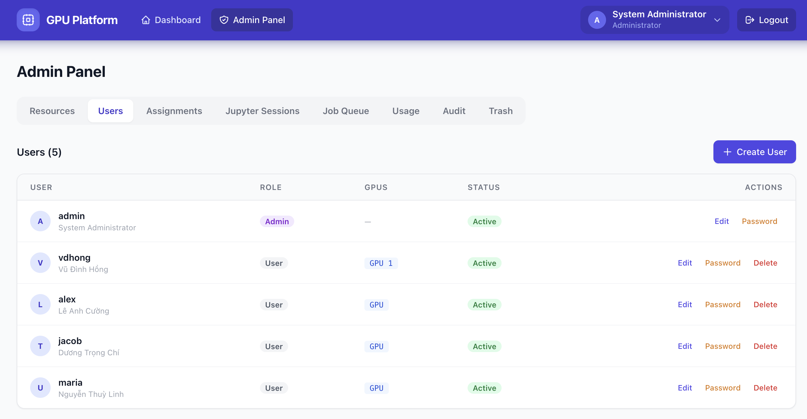
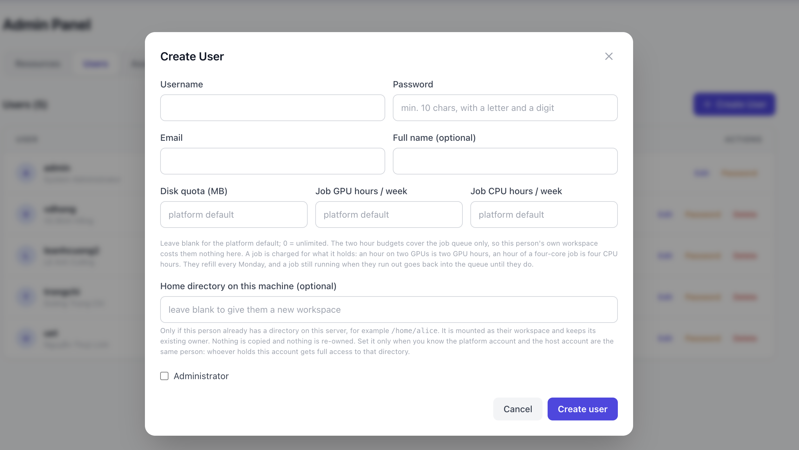
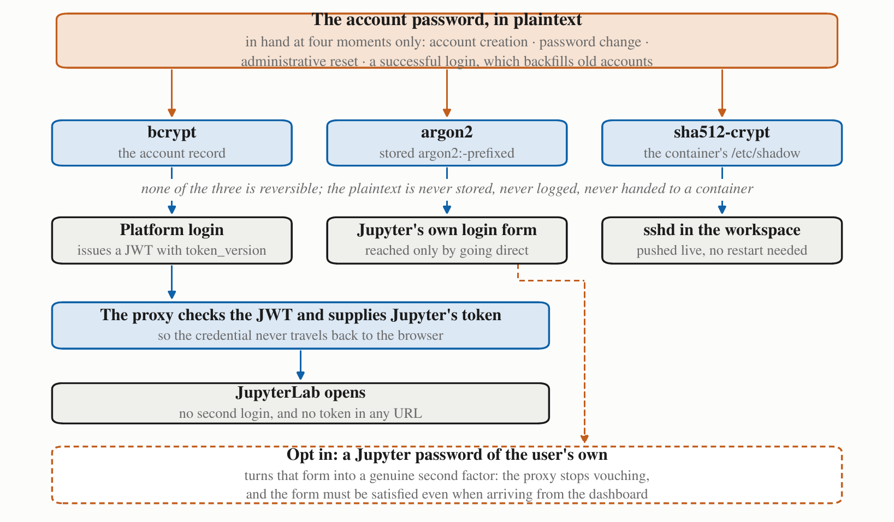
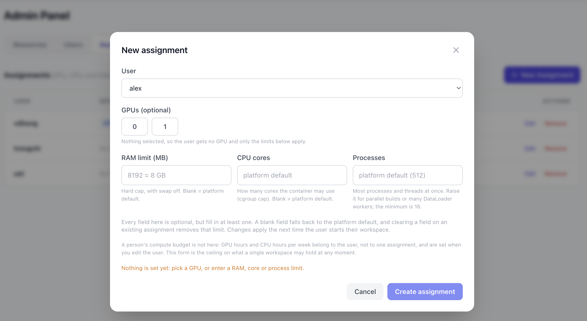
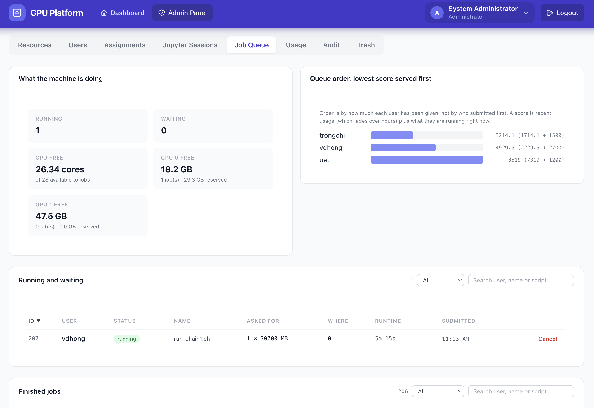
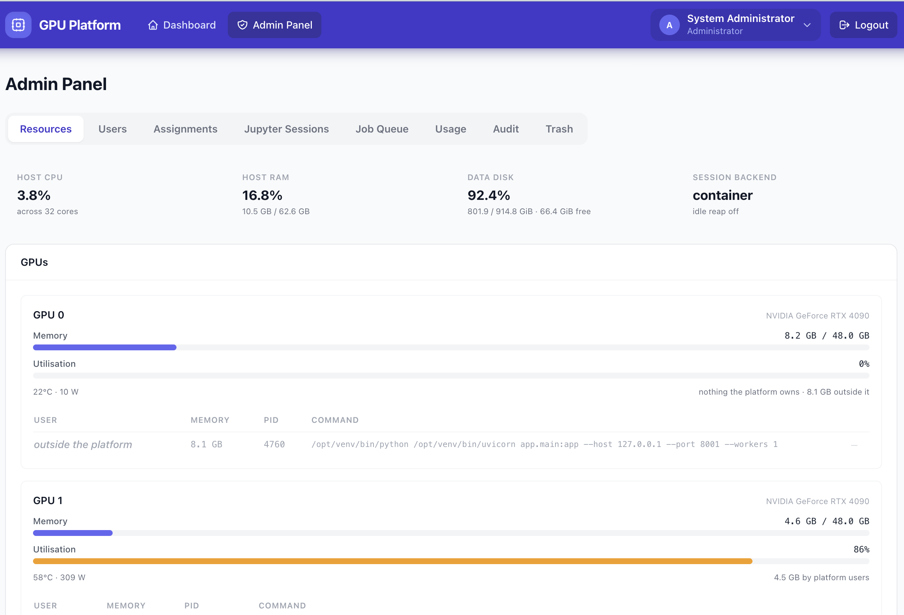
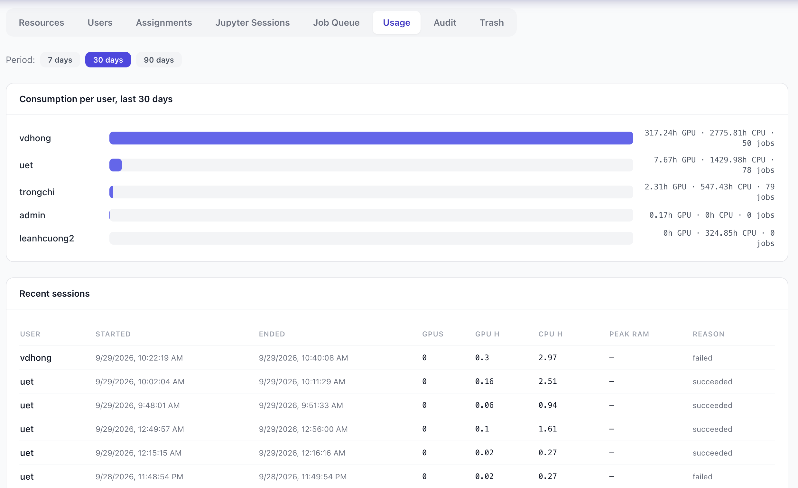

<!--
  The files under docs/images/ are placeholders. Take the screenshot each
  caption describes, save it over the placeholder with the same file name, and
  nothing else here has to change.
-->

# Administering the GPU platform

This is the operator's side: putting the platform on a machine, giving people
accounts, deciding what each of them may hold, and knowing what to look at when
somebody says the server is slow.

It assumes you have root on the host and that you are comfortable with Docker
and a text editor. It does not assume you have read the README; where a
setting has a longer story behind it, there is a pointer.

**Contents**

1. [What the host needs](#1-what-the-host-needs)
2. [Installing](#2-installing)
3. [The settings that matter](#3-the-settings-that-matter)
4. [Creating accounts](#4-creating-accounts)
5. [Quotas, and what to set them to](#5-quotas-and-what-to-set-them-to)
6. [Assignments, and when not to make one](#6-assignments-and-when-not-to-make-one)
7. [The job queue](#7-the-job-queue)
8. [Watching the machine](#8-watching-the-machine)
9. [Everyday tasks](#9-everyday-tasks)
10. [Backups, updates and logs](#10-backups-updates-and-logs)
11. [When something goes wrong](#11-when-something-goes-wrong)

---

## 1. What the host needs

| | |
|---|---|
| OS | Linux with cgroup v2. Ubuntu 22.04 or newer is what this has been run on |
| Docker | Engine 24 or newer, with the Compose v2 plugin |
| GPU | NVIDIA driver 525 or newer and `nvidia-container-toolkit`, if there are cards. The platform runs fine on a CPU-only host |
| Disk | Around 15 GB for the workspace image, plus whatever your users' files will take |
| Ports | One HTTP port for the web tier, and a range for per-user SSH (2222 upwards by default). Each user is assigned one port on their first workspace start and keeps it; deactivating or trashing the account returns it to the pool |

Check the GPU side before you start, because this is what the platform depends
on and it is easy to have half of it:

```bash
nvidia-smi                                   # driver works
docker info | grep -i runtime                # nvidia runtime registered
docker run --rm --gpus all nvidia/cuda:12.4.0-base-ubuntu22.04 nvidia-smi
```

If the third command lists your cards, you are ready.

---

## 2. Installing

```bash
git clone https://github.com/vudinhhong/gpu-platform.git
cd gpu-platform
./deploy.sh
```

The script checks the prerequisites, detects your GPUs, writes a `.env` with
generated secrets if there is not one, builds the workspace image, and starts
the stack. It picks its own HTTP mode: if something already serves port 80 on
the machine it stays out of the way and publishes only
`WEB_BIND:WEB_PORT` (127.0.0.1:7080 by default) for your existing nginx to
proxy; otherwise it runs its own nginx on 80 and 443. It prints the URL and the
next steps when it finishes.

Then, in this order:

1. Sign in as `admin` with the password from `.env` (`ADMIN_PASSWORD`).
2. Change that password immediately: your name in the top right, then
   **Change password**.
3. Put the platform behind TLS if it is reachable from outside the building.
   The README has the nginx snippet and the certbot steps.
4. Create your first user and check that a workspace starts.

Re-running `./deploy.sh` is how you apply a configuration change or an update.
It keeps `.env`, the database and everybody's files. Running workspaces and
jobs survive a backend restart; they are re-attached on the way back up.

---

## 3. The settings that matter

Everything lives in `.env`, and `.env.example` documents every key with the
reasoning. These are the ones you will actually touch:

| Setting | Default | Why you would change it |
|---|---|---|
| `ADMIN_PASSWORD` | `admin123` | Change it before anyone else can reach the machine |
| `DEFAULT_MEMORY_LIMIT_MB` | `8192` | The RAM a user gets with no assignment. On a 64 GB box with six people, 16384 is more realistic |
| `DEFAULT_CPU_CORES` | `2` | Cores per workspace. Set it against your core count and how many people work at once |
| `DEFAULT_DISK_QUOTA_MB` | `0` (unlimited) | Set it before the disk fills, not after |
| `DEFAULT_GPU_HOURS_QUOTA` | `0` (unlimited) | Weekly GPU hours for **jobs**. See section 5 |
| `DEFAULT_CPU_HOURS_QUOTA` | `0` (unlimited) | Weekly CPU core-hours for **jobs** |
| `QUOTA_TZ_OFFSET_HOURS` | `0` | Set it to your own offset so budgets refill at local midnight on Monday. Hanoi is `7` |
| `IDLE_TIMEOUT_MINUTES` | `0` (off) | The highest-value knob on a small machine: it returns cards that people forgot to release. 240 is a sane starting point |
| `JOB_MAX_RUNNING_PER_USER` | `2` | How many jobs one person may have running at once. A frozen job still counts: it will want its slot back |
| `JOB_CPU_RESERVED_CORES` | `4` | Cores kept back from the queue for the platform and for interactive work |
| `JUPYTER_IMAGES` | empty | An allow-list of images users may pick from, as `Label=ref,Label2=ref2` |
| `SSH_PASSWORD_AUTH` | `true` | Set `false` for a key-only deployment. The SSH ports are reachable and sshd is not covered by the platform's login lockout |

Changes take effect on the next `./deploy.sh`, and for per-workspace limits on
the next time that user starts their workspace.

---

## 4. Creating accounts

**Admin → Users → Create user.** Username, email, a password you hand over, and
the quotas from the next section. Everything else has a sensible default.



*Admin → Users: every account, its quotas, whether its workspace is running,
and the actions for each one.*



*The create-user form. The three quota fields are the interesting part; blank
means "use the platform default".*

A few things worth knowing:

* The password you type is the only one the person needs. It becomes their
  platform login, their JupyterLab login and their SSH password, all derived
  when you set it and none of them stored in a readable form.

  

  *How one account password reaches three consumers that each need a different
  format. Nothing here needs your attention day to day; it is worth knowing
  only because it explains why users never meet a second login.*

* **Home directory on this machine** points the account at a directory that
  already exists on the host instead of creating a new workspace. Use it when
  the person already has files there. It is deliberately not inferred from the
  username: deciding that the platform account `ubuntu` is the same person as
  the host account `ubuntu` is a judgement only you can make, and getting it
  wrong hands that directory to whoever registered the name. The path has to be
  under `HOME_MOUNT_ROOT` and visible to the backend, which
  `docker-compose.homes.yml` arranges.
* Deleting an account moves it to **Trash**. The username stays reserved, the
  files are archived rather than removed, and the usage history stays intact so
  your reports do not develop holes. Restore or purge it from there.
* Deactivating instead of deleting cuts off their access at once, including
  the notebook they have open, and keeps everything else as it is.

---

## 5. Quotas, and what to set them to

Three per-user budgets, each of which can be left blank to take the platform
default.

**Disk quota (MB).** How much space that person's files may take. The
filesystem does not enforce it, the platform measures it, so it is a soft
limit; the README explains why and what you would need for a hard one. Going
over it costs the user their GPU and the job queue but never their workspace,
because deleting files is something they can only do from inside it.
`DISK_QUOTA_ACTION=stop` additionally stops sessions that stay over, after a
grace period.

**Job GPU hours per week** and **Job CPU hours per week.** These cover the
batch queue and nothing else. A workspace is somebody's own seat at the machine
and is already bounded by their assignment; the queue is work left to run
unattended, which is where one person can quietly take the machine. So an
interactive session is never charged, never refused and never stopped for these
budgets. A session left open and unused is a real waste, but
`IDLE_TIMEOUT_MINUTES` is the tool for that, not a quota.

A job is charged for what it holds, not for what it manages to use: an hour on
two GPUs is two GPU hours, and an hour of a four-core job is four CPU hours.
Budgets refill at midnight on Monday, local time as `QUOTA_TZ_OFFSET_HOURS`
defines it.

A job still running when its owner runs out is handled by what it holds. A
**CPU-only job is frozen** where it stands and thawed at the refill, so nothing
is re-run and its frozen days cost it nothing. A **GPU job goes back into the
queue** and starts again by itself at the refill; the hours it already ran stay
charged, so a requeue is not a way to get free time. A card cannot be frozen
and lent to somebody else at the same time, which is the whole reason for the
difference. `JOB_TIME_QUOTA_CPU_ACTION` and `JOB_TIME_QUOTA_ACTION` change
either half.

Sizing them, for a machine with `G` GPUs, `C` cores and `N` people who use the
queue:

```
GPU hours available per week = G x 168
CPU hours available per week = (C - JOB_CPU_RESERVED_CORES) x 168
per person                   = the above / N, rounded up
```

A budget is a ceiling against one person taking everything, not a ration that
everyone is expected to spend, so round up rather than down. On a two-GPU,
32-core host with four active people that gives **84 GPU hours** and **1200 CPU
hours** each per week. Start there, watch **Admin → Usage** for a fortnight, and
adjust.

Leaving both at 0 is a reasonable choice for a group that gets along. Turn them
on when you find you need them, which you will usually discover from the Usage
tab.

---

## 6. Assignments, and when not to make one

**Admin → Assignments** grants a person specific GPUs and sets the ceilings for
their workspace: RAM, cores, and the maximum number of processes. Every field
is optional, but an assignment has to set at least one; a user with no
assignment at all still gets the platform defaults, so there is no
"unassigned means unlimited" hole.



*Creating an assignment: the cards this person holds, and the ceilings their
workspace runs under.*

**An assignment is not a share, and this is the most useful thing to understand
about the platform.** Someone granted GPU 0 has unrestricted use of it. No
fair-share rule applies to an interactive workspace, so they may hold all 48 GB
of it for a week, and the queue can only place jobs in whatever they happen to
leave free. The moment they take that memory back, the job placed beside them
is the one that dies.

So the way to make a card genuinely shared is to **assign it to nobody** and let
everyone reach it through `submit`, where the scheduler arbitrates, enforces
reservations and keeps the order fair. Assignments are for the person with
sustained work who really does need a card all day. They should be the
exception.

On a two-card machine, the arrangement that has worked best for us is one card
assigned to whoever is in the middle of a deadline, and one card left to the
queue for everybody.

---

## 7. The job queue

The queue is what turns static assignments into shared time. Anyone may submit,
with or without an assignment, and a job runs in a container built from the
same code path as its owner's workspace, so it is limited exactly as they are.



*Admin → Job Queue: what the machine is doing and the queue order side by
side, then two tables, running and finished, each paged and filterable.*

The tab is four boxes. The top two sit side by side: what the machine is doing
right now (running, waiting, frozen, free CPU and free VRAM per card) and the
fair-share scores that decide who goes next. Below them, **Running and
waiting** holds everything on the machine whoever owns it, with a Cancel on
each row, and **Finished jobs** is every user's history. Both are paged and
can be narrowed by status or searched by user, job name or script; clicking a
column heading sorts the whole list, not the page you are looking at. The
counts in the top box are always over the whole system, so paging through the
history does not make them move.

What you can control:

* `JOB_MAX_RUNNING_PER_USER` and `JOB_MAX_QUEUED_PER_USER` bound one person's
  footprint.
* `JOB_GPU_HEADROOM_MB` keeps a card from being filled to the last megabyte.
* `JOB_CPU_POOL_CORES` and `JOB_CPU_RESERVED_CORES` decide how much CPU the
  queue may hand out.
* `JOB_GPU_OVERRUN_ACTION` decides what happens to a job holding much more VRAM
  than it asked for. The default stops it and tells the owner what it really
  used. Setting it to `warn` makes reservations advisory, which in practice
  means they stop being true.
* The four fair-share parameters (`FAIRSHARE_*`) set how strongly recent usage
  pushes somebody down the queue. The defaults suit a group where people work
  in bursts; the README explains each one.

Order is by fair share, not arrival: the person who has been given the least
goes first, with ties falling back to submission time. Ten jobs from one person
will not push everybody else behind them. **Admin → Job Queue** shows the order
the scheduler will actually use, and **Admin → Usage** shows the scores behind
it.

You can cancel anybody's job from this tab. The owner sees why.

---

## 8. Watching the machine

**Admin → Resources** is the one screen to keep open when somebody reports that
the machine is slow.



*Admin → Resources: host CPU, memory and disk, both GPUs with the processes on
them, and a row per user showing what they are holding right now.*

It answers the questions that actually come up: who is on which card, whose
container is using the memory, who is over their disk quota, and what the
daemon really applied to each container rather than what was configured.

**Admin → Usage** is the record. GPU hours, CPU hours, job counts and outcomes
per person over 7, 30 or 90 days, plus every session with when it started, when
it ended and why.



*Admin → Usage: consumption per person over the last 30 days, and the session
list behind it.*

**Admin → Audit** has every privileged action with actor, target and address:
logins, account changes, password resets, quota stops, cancelled jobs. It is
the first place to look after anything surprising.

**Admin → Jupyter Sessions** lists live workspaces and lets you stop one.

---

## 9. Everyday tasks

**Reset somebody's password.** Admin → Users → the account → Reset password.
Their open sessions stop working at once, and the SSH and Jupyter credentials
inside a running workspace are updated in place, so the new password works over
SSH without anybody restarting anything.

**Free a card in a hurry.** Admin → Jupyter Sessions → Stop for the workspace
holding it, or Admin → Job Queue → Cancel for a job. The dashboard asks before
either, and spells out what the person loses; once confirmed both are
immediate, and both are visible to the owner.

**Stop people forgetting cards.** Set `IDLE_TIMEOUT_MINUTES`. The reaper stops
sessions with no traffic for that long, closes their ledger row with reason
`idle` and writes an audit entry. Tell people before you turn it on.

**Offer a second image.** Build it, then list it in `JUPYTER_IMAGES` as
`Label=image:tag`. Users pick from that list on their dashboard and get nothing
outside it, because the client must never name an image to run on the host.

**Add a system package for everybody.** Edit `backend/jupyter.Dockerfile`, run
`./deploy.sh`, and ask people to restart their workspaces. Their own files and
`pip --user` packages are untouched by the rebuild.

**Give somebody an existing home directory.** Set the home path on their
account (section 4). Check afterwards that Admin → Resources shows a real disk
figure for them rather than 0 MB, which is how you tell the backend can see the
directory.

---

## 10. Backups, updates and logs

**What to back up.** Two things, and they are small:

```bash
data/            # the SQLite database: accounts, assignments, jobs, ledger, audit
.env             # secrets and configuration
```

plus `jupyter_data/`, which is everyone's files and is as large as your users
make it. A nightly `sqlite3 data/gpu_platform.db ".backup ..."` and an rsync of
the workspaces is enough; there is nothing else stateful.

**Updating.**

```bash
git pull
./deploy.sh
```

Database migrations run automatically at start. Running workspaces and jobs are
left alone and re-attached, so an update in the middle of the afternoon costs
people nothing except the few seconds the API is down.

**Logs.**

```bash
docker compose logs -f backend          # the platform itself
docker logs gpu-jupyter-<username>      # one user's workspace
docker logs gpu-job-<id>                # one job's container
```

**Tests.** The suite needs no GPU and touches nothing that is running:

```bash
./scripts/run_tests.sh                  # in a throwaway container
```

There is also an end-to-end script that drives a live deployment and asserts
against the cgroup files themselves. `scripts/README.md` says how to run it.

---

## 11. When something goes wrong

| Symptom | Likely cause | What to do |
|---|---|---|
| Workspaces will not start, backend logs mention the image | The workspace image is missing | `./deploy.sh` rebuilds it. Until then sessions fall back to a CPU-only process backend |
| A container sees every GPU | It was created without a device request, and the host's default runtime is `nvidia` | Check the assignment, then Admin → Resources, which reads back what the daemon applied |
| 504 from your own nginx, but the port answers | A default-DROP OUTPUT policy on the host blocking docker-proxy | `sudo bash scripts/host_firewall_setup.sh` |
| The audit log shows an IP that cannot be right | Your host nginx passes `X-Forwarded-For` on from the client instead of replacing it, so the caller chooses what gets recorded | In each `location` of your server block, `proxy_set_header X-Forwarded-For $remote_addr;` (not `$proxy_add_x_forwarded_for`), then `sudo nginx -t && sudo systemctl reload nginx`. The shipped `nginx/host/gpu-platform.conf` already does this |
| The platform shows no GPUs but `nvidia-smi` on the host is fine | systemd reapplied a container's device policy and revoked `/dev/nvidia*` from it, usually after an apt upgrade ran `daemon-reload` | Recreate the affected container: `./deploy.sh` for the backend, a workspace restart for a user. Containers created since this was fixed name their devices in the spec and survive it; check with `systemctl show docker-$(docker inspect -f '{{.Id}}' <container>).scope -p DeviceAllow \| grep 195:` |
| A GPU "detaches" from an idle container | Driver persistence mode is off | `scripts/host_gpu_setup.sh`, which `deploy.sh` runs for you as root |
| Disk full, quotas all look fine | The quota is measured, not imposed by the filesystem, and it only covers user workspaces | Check `docker system df` for images and stopped containers, then Admin → Resources |
| Somebody's disk figure reads 0 MB against a quota they are over | A mapped home directory the backend cannot see | Check the path and that `docker-compose.homes.yml` is in play |
| Jobs stay queued with nothing running | Read the reason on the job; it is written in words | Usually VRAM, cores, or an owner who is out of budget |
| A user says their card vanished | They went over their disk quota, so the workspace started without a GPU | Their resource card says so; they free space and restart |

If you find behaviour that contradicts this guide, the repository's
`README.md` is where the current rough edges are recorded, deliberately and
with their reasons: see *Disk I/O* for the settings that look like limits and
are not, and *Left undone on purpose* for what the platform does not attempt.

---

For the user-facing half of all this, hand people the
[user guide](user-guide.md). For the design and the reasoning behind each
decision, the [README](../README.md) is long but it does explain itself.
