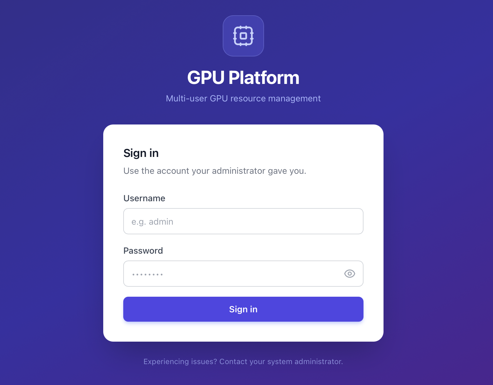
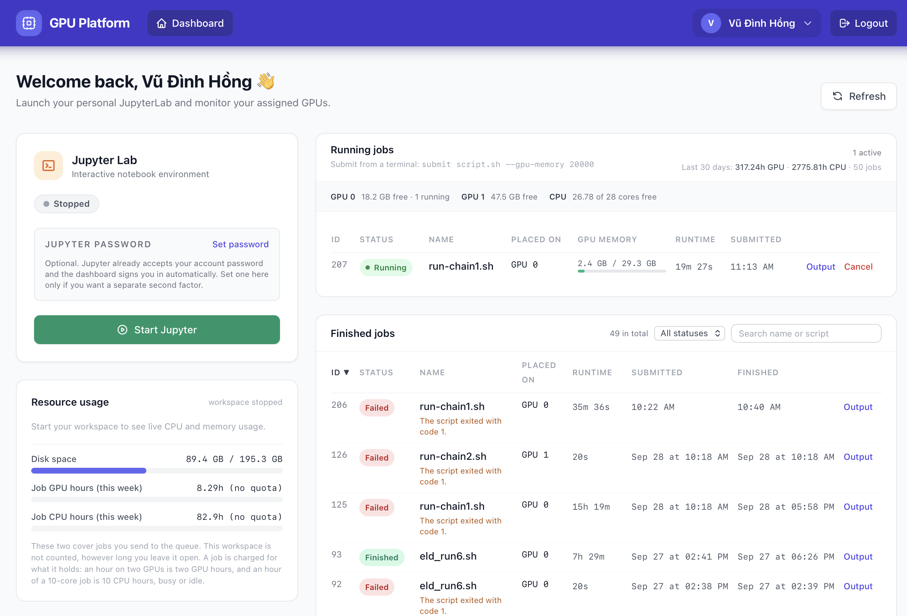
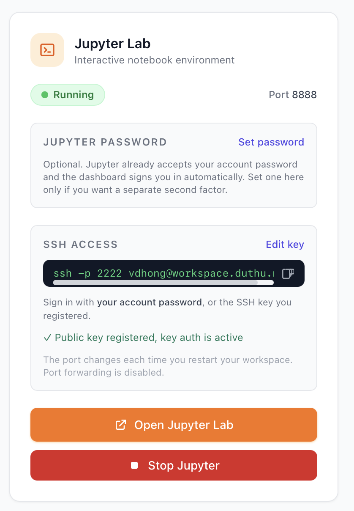
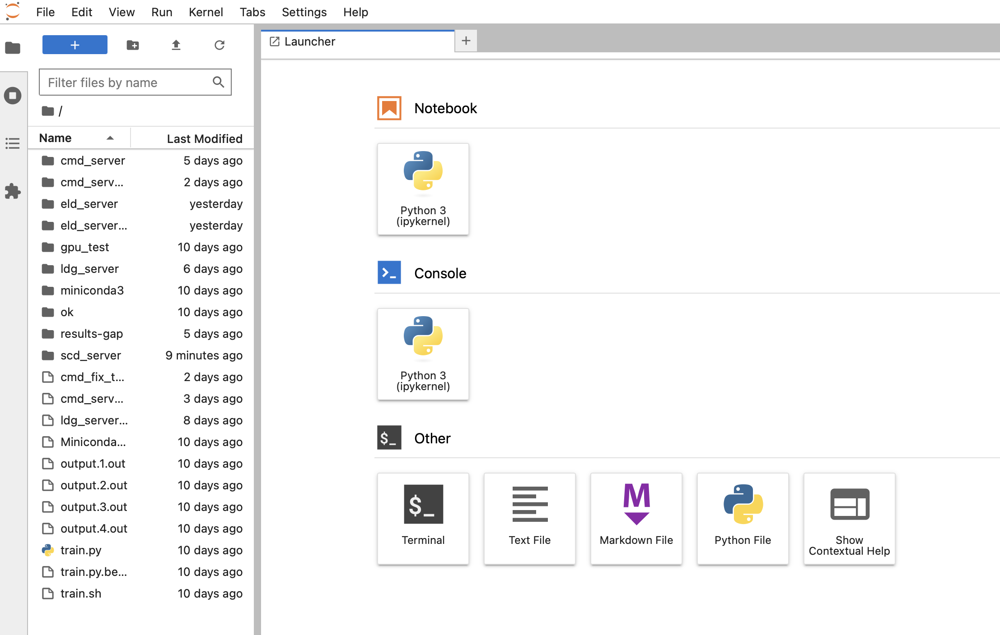
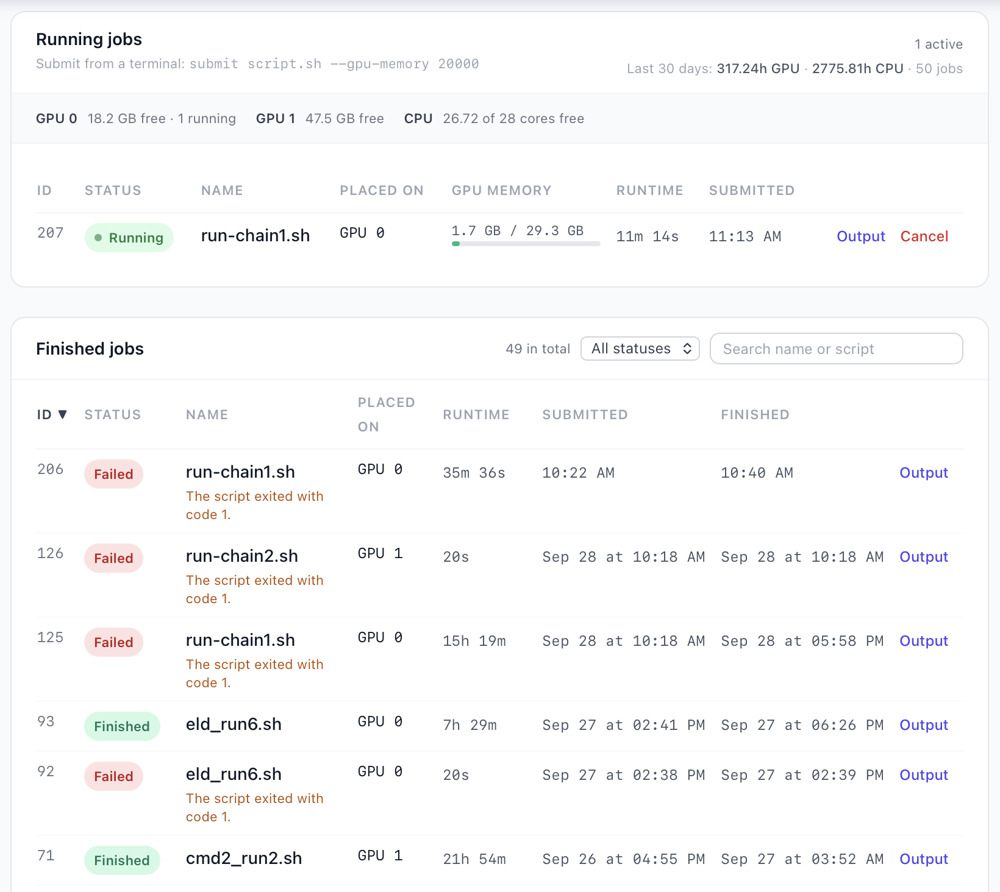
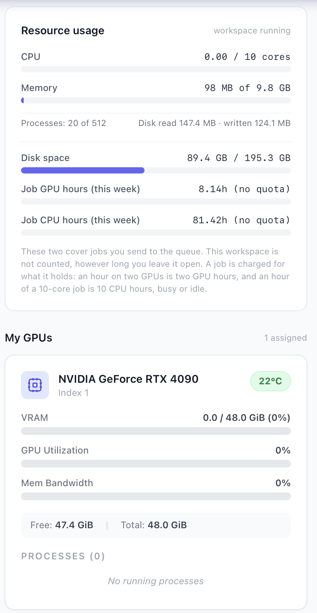

<!--
  The files under docs/images/ are placeholders. Take the screenshot each
  caption describes, save it over the placeholder with the same file name, and
  nothing else here has to change.
-->

# Using the GPU platform

You have an account on a machine that several people share. The platform gives
you two things: a **workspace**, which is a private Linux environment with
JupyterLab, a terminal and your own files in it, and a **job queue**, where you
hand a script to the machine and it runs when there is room.

Everything below assumes you know the address of the platform and your
username and password. If you do not, ask whoever administers the machine.

**Contents**

1. [Signing in](#1-signing-in)
2. [Starting your workspace](#2-starting-your-workspace)
3. [Working in JupyterLab](#3-working-in-jupyterlab)
4. [Your files, and what survives a restart](#4-your-files-and-what-survives-a-restart)
5. [Installing packages](#5-installing-packages)
6. [Connecting over SSH](#6-connecting-over-ssh)
7. [Seeing what you actually have](#7-seeing-what-you-actually-have)
8. [Your GPUs](#8-your-gpus)
9. [Running jobs](#9-running-jobs)
10. [Choosing `--gpu-memory`](#10-choosing---gpu-memory)
11. [Your budgets](#11-your-budgets)
12. [When something goes wrong](#12-when-something-goes-wrong)
13. [Being a good neighbour](#13-being-a-good-neighbour)

---

## 1. Signing in

Open the platform address in a browser and sign in with the username and
password you were given.



*The sign-in page. Nothing else on the platform is reachable without an
account, including your notebook server.*

Change your password the first time you sign in: click your name in the top
right, then **Change password**. That one password is also your SSH password
and your JupyterLab password, so changing it changes all three at once.

---

## 2. Starting your workspace

The dashboard is what you see after signing in. The card at the top left is
your workspace; it starts out stopped, because a workspace holds memory and
possibly a GPU, and nobody should be holding those while they are not here.



*The dashboard: the workspace card, the GPUs you hold, your resource usage and
your jobs, all on one page.*

Press **Start Jupyter**. The first start takes a little longer than the rest,
usually ten to thirty seconds, because the container has to be created. When it
is ready the card turns green and grows two more buttons.



*A running workspace: Open Jupyter Lab, the SSH command with your port, and
Stop Jupyter.*

**Open Jupyter Lab** opens your notebook server in a new tab. You are signed in
already; there is no token to copy and no second password to type.

**Stop Jupyter** shuts the workspace down. Do that when you finish for the day.
Your files stay exactly where they are, and so do the packages you installed.
What you lose is the state of any running notebook kernel, which is the same
thing you lose by restarting a kernel.

---

## 3. Working in JupyterLab

Inside it is ordinary JupyterLab: notebooks, a file browser, and a terminal
under **File → New → Terminal**. The terminal is a real shell on your own
account in the workspace, and it is where the job commands in section 9 live.



*JupyterLab running in a workspace, with a notebook open and the file browser
showing the user's own files.*

---

## 4. Your files, and what survives a restart

Your home directory in the workspace is yours and it is on disk, not in the
container. Stopping the workspace, restarting it, or the administrator
rebuilding the image does not touch it.

| Where | What happens to it |
|---|---|
| Your home directory (notebooks, data, `~/.local`, conda envs you created there) | Kept. This is the one place to put anything you care about |
| `/tmp` and anything outside your home | Gone when the workspace stops |
| Running notebook kernels | Gone when the workspace stops |

Nobody else can read your files, and you cannot read theirs.

---

## 5. Installing packages

Install whatever you need. `pip` is already set to install into your own
account, so no `sudo` and no `--user` flag are needed:

```bash
pip install transformers accelerate
```

Conda works too, as long as the environment lives in your home directory:

```bash
conda create -p ~/envs/myproject python=3.11
conda activate ~/envs/myproject
```

Both survive restarts. If a package needs a system library that is not in the
image, ask the administrator: system packages belong in the image so that
everybody gets them, rather than in one person's home.

---

## 6. Connecting over SSH

The workspace card shows the exact command, including your port, which is
yours and does not change:

```bash
ssh -p 2231 alice@gpu-server.example.edu
```

Your password is your platform account password. If you registered an SSH key
on the card, the key works as well and you will not be asked for anything.

This is also how you attach VS Code: **Remote-SSH** with the same host, port
and user gives you the editor running against the workspace, with your GPUs.

The workspace has to be running for SSH to answer. Start it from the dashboard
first.

---

## 7. Seeing what you actually have

The standard tools lie to you in a container. `nproc`, `free`, `df` and `top`
read the whole machine, so a workspace capped at 4 cores and 16 GB reports 32
cores and 62 GB. The platform ships replacements that report your real
allocation, and the `limits` command prints everything at once:

```
$ limits

Your workspace
----------------------------------------------------------
  Memory        3.8 GiB used of 16.0 GiB
  CPU           4 cores
  Processes     13 of 512
  Disk speed    read 150.0 MiB/s, write 80.0 MiB/s
  Disk space    88402 MB used of 200000 MB (44%)
  Job GPU hrs   12 of 84 used (14%)
  Job CPU hrs   180 of 1200 used (15%)
                refills Mon 29 Sep at 00:00; a job still running when it
                runs out is paused, or put back in the queue if it holds a GPU
  GPU           NVIDIA GeForce RTX 4090, 49140 MiB
----------------------------------------------------------
```

It also prints automatically when you log in over SSH. Use these numbers when
you size a batch or a data loader. Because the replacements are what you get by
default, `nproc` answers 4 here rather than 32, so `make -j$(nproc)` does the
right thing; it is only the full path, `/usr/bin/nproc`, that still reports the
whole host.

---

## 8. Your GPUs

If the administrator assigned you a card, it is yours while your workspace
runs, and only yours. Inside the workspace it is always numbered from zero, so
your code says `cuda:0` whatever the physical card is:

```python
import torch
torch.cuda.device_count()        # how many you were given
torch.cuda.get_device_name(0)
```

`nvidia-smi` inside the workspace lists your cards and nothing else. You cannot
see or touch anybody else's, and they cannot reach yours.

If you have no assignment, `device_count()` returns 0 and that is expected. It
does not mean you cannot use a GPU: it means you use one through the queue,
which is what the next section is about. Plenty of people work that way by
choice, because a card you hold all day is a card nobody else can have.

---

## 9. Running jobs

A job is a shell script the machine runs for you, on a GPU, when one has room.
You do not have to be online while it runs, and you do not need an assignment
to submit one.

Write an ordinary script:

```bash
#!/bin/bash
cd ~/project
python train.py --epochs 50
```

Then, from a terminal in your workspace:

```bash
submit train.sh --gpu-memory 20000 --name nightly
```

Four commands is the whole interface:

| Command | What it does |
|---|---|
| `submit <script>` | Queue a script. `--gpu-memory MB` asks for a GPU, `--gpus N` for more than one, `--max-minutes N` stops it after a while, `--name` labels it |
| `queue` | The shared queue: what the whole machine is doing and what is waiting. `queue <id>` opens one of your own jobs |
| `myjobs` | Your jobs, newest first, finished ones included |
| `cancel <id>` | Take a job out of the queue, or stop it if it is running |

Every one of them takes `--help`.

Output goes to `output.<job id>.out` next to where you submitted from, and it
is written as the job runs, so you can `tail -f` it. The dashboard shows the
end of it too.



*The jobs panel on the dashboard: what is running, what is waiting, why it is
waiting, and the tail of the output.*

The table below it is your history. It shows when each job was submitted and
when it finished, and because that list gets long, you can narrow it to one
status, search it by name or script, and sort it by clicking a column
heading.

A job that has not started yet always has a reason, and `queue <id>` prints it
in plain words: waiting for GPU memory, waiting for cores, you are already at
your limit of running jobs, or nothing at all, which means it starts on the
next pass. The
scheduler serves the person who has been given the least first, not the person
who submitted first, so ten jobs of yours will not push somebody else's single
job to the back.

---

## 10. Choosing `--gpu-memory`

This is the one number worth getting right, so it deserves its own section.

`--gpu-memory` is how much VRAM your job needs, in megabytes, per GPU. It
decides two things: which card your job is placed on, and how much room the
scheduler thinks is left over for everybody else.

* **State a figure and you get a GPU.** The job waits for a card with that much
  free, and starts when one has it.
* **State nothing and it runs on CPU.** That is not a penalty. A preprocessing
  job that does not touch CUDA starts as soon as cores are free, usually at
  once.

Since the scheduler fits other people's work into the space you did not ask
for, the figure has to be honest, and the platform holds you to it. A job that goes well past
its request is stopped and told what it really used, so it can be resubmitted
with a true number. There is some tolerance built in, roughly ten per cent plus
a gigabyte, because a CUDA context costs a few hundred megabytes before your
first tensor exists.

Asking for far more than you need is not punished, but it is not free either:
it makes your job wait for a card that is emptier than it has to be, and it
keeps that space away from everybody else while you run.

The practical way to find your number: run the job once, watch
`nvidia-smi` or `torch.cuda.max_memory_allocated()`, round up to the next
gigabyte or so, and use that from then on.

---

## 11. Your budgets

Three numbers on the resource card, and only one of them can stop you working.



*The resource card: live CPU and memory for the running workspace, disk space
against your quota, and the two weekly job budgets.*

**Disk space.** How much your files take, against your quota. Going over it
does not cost you your workspace, because deleting files is something you can
only do from inside it. What it costs is the GPU and the queue: the workspace
still starts, without a card, and `submit` refuses until you are back under.

**Job GPU hours** and **job CPU hours**, per week. These cover jobs and nothing
else. Time you spend in your own workspace is not counted, however long you
leave it open, so there is no meter running while you read your results.

A job is charged for what it holds rather than what it uses: an hour on two
GPUs is two GPU hours, and an hour of a four-core job is four CPU hours,
whether the job is busy or idle. The week refills at midnight on Monday.

If you run out, nothing new starts from the queue, and a job that is already
running is dealt with according to what it holds:

* **A job with no GPU is paused.** It freezes exactly where it is and the
  platform thaws it when the budget refills. Nothing is lost and nothing is
  re-run. It shows as **Paused** until then, and the time it spends frozen is
  not charged to you.
* **A job with a GPU goes back into the queue** and starts again by itself once
  the budget refills. It is not lost and you do not have to resubmit it, but it
  does restart from the beginning and rewrite its output file. A card cannot be
  frozen and handed to somebody else at the same time, which is why this one
  cannot simply pause.

That second case is the reason to checkpoint anything long:

```python
torch.save({"epoch": epoch, "model": model.state_dict()}, "ckpt.pt")
```

---

## 12. When something goes wrong

| What you see | What it usually is | What to do |
|---|---|---|
| Workspace will not start, "could not start your workspace" | Something on the host, not you | Try once more, then tell the administrator; the details are in the server log |
| The workspace stops by itself | An idle timeout, if the administrator set one | Start it again. Use the queue for work that has to survive you closing the laptop |
| A notebook dies with no message, or the container restarts | Out of memory. Your allocation is in `limits` | Smaller batch, fewer data-loader workers, or ask for more RAM |
| `CUDA out of memory` | Your model does not fit the card, or a job of yours is sharing it | Smaller batch, gradient accumulation, or `--gpu-memory` closer to the truth |
| Job is queued and never starts | `queue <id>` tells you why in one line | Usually waiting for VRAM, cores, or your own running jobs to finish |
| Job stopped with "it was holding NNNN MB" | It went past `--gpu-memory` | Resubmit with the figure the message suggests |
| Job back in the queue saying you are out of hours | Your weekly GPU budget ran out | It restarts on its own when the budget refills; ask for more if you need more |
| Job sitting at **Paused** | Your weekly CPU budget ran out | It thaws by itself at the refill and carries on from the same point; nothing is lost |
| `submit` says your workspace is too full | Disk quota | Delete something, then submit again |
| `nproc` says 32 but `limits` says 4 | You called `/usr/bin/nproc` directly | Use plain `nproc`, or read `limits` |

---

## 13. Being a good neighbour

None of this is enforced by the software, and all of it is noticed by the
people you share the machine with.

* Stop your workspace when you finish for the day. A card held by a forgotten
  notebook is the single most common way this machine goes to waste.
* Put long runs in the queue rather than in a notebook. They survive your
  laptop closing, they are recorded, and they let the scheduler interleave
  other people's work with yours.
* Checkpoint anything that runs for hours.
* Ask for the VRAM you need and not more.
* Keep large datasets in one copy. Four people with the same corpus is four
  times the disk.

---

Anything the platform decides about you is visible to you: your limits in
`limits`, your usage on the dashboard, and the reason for every refusal in the
message itself. If one of them is wrong or unclear, that is worth reporting.

For how the platform is administered, see the
[administrator guide](admin-guide.md). For how it works underneath, see the
[README](../README.md).
